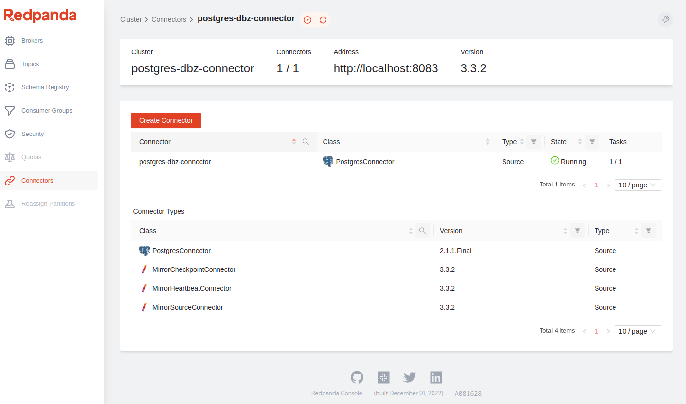
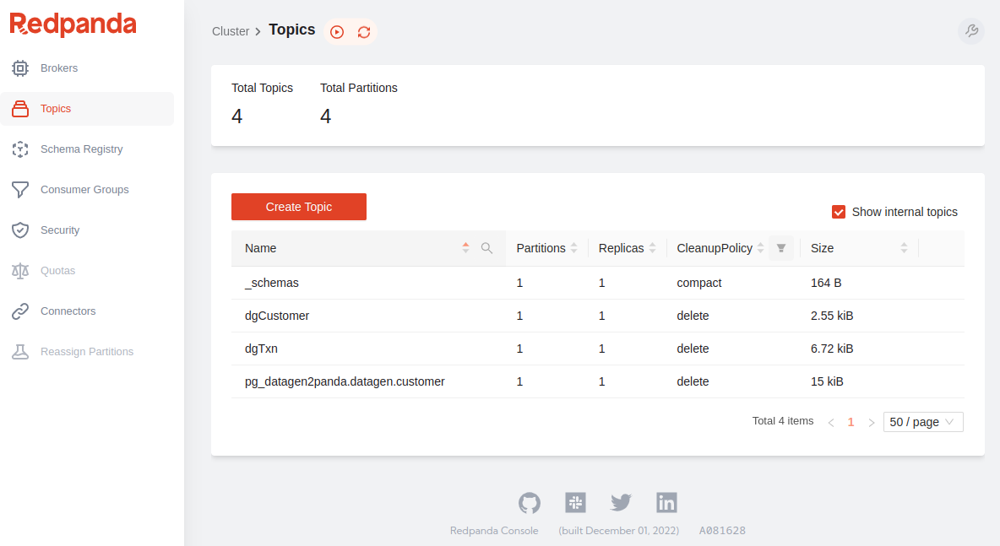
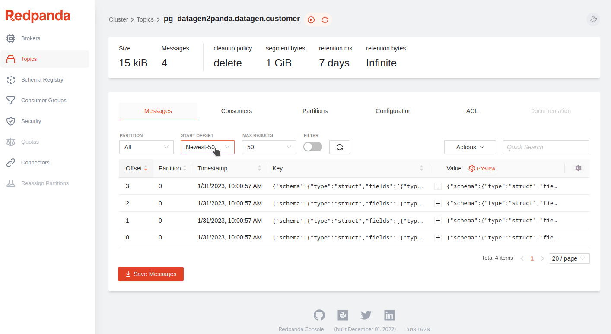
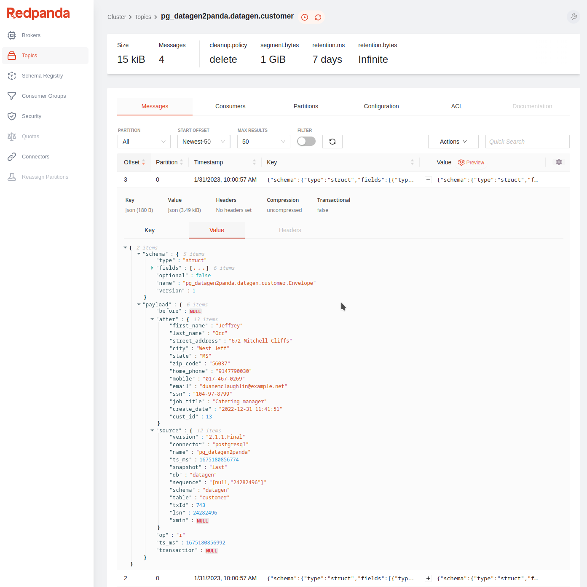

# Data Origination Workshop 
---
---

## Objective:
The goal of this workshop was to evaluate Red Panda and Kafka Connect (with the Debezium CDC plugin) and set up a data generator that streams events to this platform. My good friend an collegue [Craig Nelson](https://www.linkedin.com/in/craig-nelson-4333972/), wrote a great blog recently on doing this via docker.  Check it out here:  [Craig's Blog](https://electricboogaloo.home.blog/2023/01/18/postgres-cdc-with-redpanda-in-six-easy-pieces-part-1-0/)

I took the time to install it manually on a tradition linux server and then wrote the setup script in this repo so others could try it out too. Please take the time to review that script [`setup_data_origination_apps.sh`](./setup_data_origination_apps.sh). Hopefully it becomes a reference for you one day if you use any of this technology.  In an upcoming workshop, we will integrate this data platform and stream data from here into our Apache Iceberg data lake built in a previous workshop.   Check out my [Apache Iceberg Workshop](https://github.com/tlepple/iceberg-intro-workshop) for more details on that.

---
---

# Highlights:

---

The setup script will build and install our `Data Origination Platform` onto a single Linux instance.  It installs a data generating application, a local SQL database (PostgreSQL), a Red Panda instance, a stand-alone Kafka Connect instance, a Debezium plugin for Kafka Connect and configures them all to work together.   
 
---
---

###  Pre-Requisites:

---

 * I built this on a new install of Ubuntu Server
 * Version: 20.04.5 LTS 
 * Instance Specs: (min 4 core w/ 8 GB ram & 30 GB of disk) -- add more RAM if you have it to spare.

---
###  Install Git tools and pull this repo.
*  ssh into your new Ubuntu 20.04 instance and run the below command:

---

```
sudo apt-get install git -y

cd ~
git clone https://github.com/tlepple/data_origination_workshop.git
```

---

### Start the build:

```
#  run it:
. ~/data_origination_workshop/setup_data_origination_apps.sh
```
  *  This should complete within 5 minutes.
---

###  What is Redpanda?
  * Information in this section was gathered from their website.  You can find more detailed information about their platform here:  [Red Panda](https://redpanda.com/platform)
---

Redpanda is an event streaming platform: it provides the infrastructure for streaming real-time data.  It has been proven to be 10x faster and 6x lower in total costs. It is also JVM-free, ZooKeeper®-free, Jepsen-tested and source available.

Producers are client applications that send data to Redpanda in the form of events. Redpanda safely stores these events in sequence and organizes them into topics, which represent a replayable log of changes in the system.

Consumers are client applications that subscribe to Redpanda topics to asynchronously read events. Consumers can store, process, or react to the events.

Redpanda decouples producers from consumers to allow for asynchronous event processing, event tracking, event manipulation, and event archiving. Producers and consumers interact with Redpanda using the Apache Kafka® API.

| Event-driven architecture (Redpanda)     | Message-driven architecture |
| ----------- | ----------- |
| Producers send events to an event processing system (Redpanda) that acknowledges receipt of the write. This guarantees that the write is durable within the system and can be read by multiple consumers.     | Producers send messages directly to each consumer. The producer must wait for acknowledgement that the consumer received the message before it can continue with its processes.       |


Event streaming lets you extract value out of each event by analyzing, mining, or transforming it for insights. You can:

  *  Take one event and consume it in multiple ways.
  *  Replay events from the past and route them to new processes in your application.
  *  Run transformations on the data in real-time or historically.
  *  Integrate with other event processing systems that use the Kafka API.


####  Redpanda differentiators:
Redpanda is less complex and less costly than any other commerecial mission-critical event streaming platform. It's fast, it's easy, and it keeps your data safe.

  *  Redpanda is designed for maximum performance on any data streaming workload.

  *  It can scale up to use all available resources on a single machine and scale out to distribute performance across multiple nodes. Built on C++, Redpanda delivers greater throughput and up to 10x lower p99 latencies than other platforms. This enables previously-unimaginable use cases that require high throughput, low latency, and a minimal hardware footprint.

  *  Redpanda is packaged as a single binary: it doesn't rely on any external systems.

  *  It's compatible with the Kafka API, so it works with the full ecosystem of tools and integrations built on Kafka. Redpanda can be deployed on bare metal, containers, or virtual machines in a data center or in the cloud. Redpanda Console also makes it easy to set up, manage, and monitor your clusters. Additionally, Tiered Storage lets you offload log segments to cloud storage in near real time, providing infinite data retention and topic recovery.

  *  Redpanda uses the Raft consensus algorithm throughout the platform to coordinate writing data to log files and replicating that data across multiple servers.

  *  Raft facilitates communication between the nodes in a Redpanda cluster to make sure that they agree on changes and remain in sync, even if a minority of them are in a failure state. This allows Redpanda to tolerate partial environmental failures and deliver predictable performance, even at high loads.

  *  Redpanda provides data sovereignty.

---
---
###  Hands On Workshop begins here:
---
---

####  Explore the Red Panda CLI tool `RPK`  
  *   Redpanda Keeper `rpk` is Redpanda's command line interface (CLI) utility.  Detailed documentation of the CLI can be explored further here: [Redpanda Keeper Commands](https://docs.redpanda.com/docs/reference/rpk/)

#####  Create our first Redpanda topic with the CLI:
*  run this from a terminal window:
```
#  Let's create a topic with RPK
rpk topic create movie_list
```
####  Start a Redpanda `Producer` using the `rpk` CLI to add messages:
  *  this will open a producer session and await your input until you close it with `<ctrl> + d`
```
rpk topic produce movie_list
```

####  Add some messages to the `movie_list` topic:
  *  The producer will appear to be hung in the terminal window.   It is really just waiting for you to type in a message and hit `<return`.


######  Entry 1:
```
Top Gun Maverick
```
######  Entry 2:
```
Star Wars - Return of the Jedi
```
#### Expected Output:
```
Produced to partition 0 at offset 0 with timestamp 1675085635701.
Star Wars - Return of the Jedi
Produced to partition 0 at offset 1 with timestamp 1675085644895.
```

##### Exit the producer:  `<ctrl> + d`

####  View these messages from Redpanda `Consumer` using the `rpk` CLI:

```
rpk topic consume movie_list --num 2
```

---

####  Expected Output:

```
{
  "topic": "movie_list",
  "value": "Top Gun Maverick",
  "timestamp": 1675085635701,
  "partition": 0,
  "offset": 0
}
{
  "topic": "movie_list",
  "value": "Star Wars - Return of the Jedi",
  "timestamp": 1675085644895,
  "partition": 0,
  "offset": 1
}

```
---
---

##  Explore the Red Panda GUI:
  *  Open a browser and navigate to your host ip address:  `http:\\<your ip address>:8080`  This will open the Red Panda GUI

---
---
  
  
  
---

####  We can delete this topic from the `rpk` CLI:

```
rpk topic delete movie_list
```
---
---

### Data Generator:
---

I have written a data generator CLI application and included it in this workshop to simplify creating some realistic data for us to explore.  We will use this data generator application to stream some realistic data directly into some topics (and later into a database).  The data generator is written in python and uses the component [Faker](https://faker.readthedocs.io/en/master/).  I encourage you to look at the code here if you want to look deeper into it.  [Data Generator Items](./datagen)   

---

#####  Let's create some topics for our data generator using the CLI:
```
rpk topic create dgCustomer
rpk topic create dgTxn
```
---
##### Console view of our `Topics`:
  

---
---

#####  Data Generator Notes:   
---

The data generator app in this section accepts 3 integer arguments:  
  *  An integer value for the `customer key`.
  *  An integer value for the `N` number of groups to produce in small batches.
  *  An integer value for `N` number of times to loop until it will exit the script.

---
#####  Call the `Data Generator` to stream some messages to our topics:
---

We will switch to a different OS user `datagen` (password for user: `supersecret1`) where the data generation tool was installed during setup.  From a terminal window run:

##### Command:
```
su - datagen
```


```
cd ~/datagen

#  start the script:
python3 redpanda_dg.py 10 3 2
```

##### Sample Output:

This will load sample json data into our two new topics and write out a copy of those records to your terminal that looks something like this:

---

```
{"last_name": "Mcmillan", "first_name": "Linda", "street_address": "7471 Charlotte Fall Suite 835", "city": "Lake Richardborough", "state": "OH", "zip_code": "25649", "email": "tim47@example.org", "home_phone": "001-133-135-5972", "mobile": "001-942-819-7717", "ssn": "321-16-7039", "job_title": "Tourism officer", "create_date": "2022-12-19 20:45:34", "cust_id": 10}
{"last_name": "Hatfield", "first_name": "Denise", "street_address": "5799 Solis Isle", "city": "Josephbury", "state": "LA", "zip_code": "61947", "email": "lhernandez@example.org", "home_phone": "(110)079-8975x48785", "mobile": "976.262.7268", "ssn": "185-93-0904", "job_title": "Engineer, chemical", "create_date": "2022-12-31 00:29:36", "cust_id": 11}
{"last_name": "Adams", "first_name": "Zachary", "street_address": "6065 Dawn Inlet Suite 631", "city": "East Vickiechester", "state": "MS", "zip_code": "52115", "email": "fgrimes@example.com", "home_phone": "001-445-395-1773x238", "mobile": "(071)282-1174", "ssn": "443-22-3631", "job_title": "Maintenance engineer", "create_date": "2022-12-07 20:40:25", "cust_id": 12}
Customer Done.


{"transact_id": "020d5f1c-741d-40b0-8b2a-88ff2cdc0d9a", "category": "teal", "barcode": "5178387219027", "item_desc": "Government training especially.", "amount": 85.19, "transaction_date": "2023-01-07 21:24:17", "cust_id": 10}
{"transact_id": "af9b7e7e-9068-4772-af7e-a8cb63bf555f", "category": "aqua", "barcode": "5092525324087", "item_desc": "Take study after catch.", "amount": 82.28, "transaction_date": "2023-01-18 01:13:13", "cust_id": 10}
{"transact_id": "b11ae666-b85c-4a86-9fbe-8f4fddd364df", "category": "purple", "barcode": "3527261055442", "item_desc": "Likely age store hold.", "amount": 11.8, "transaction_date": "2023-01-26 01:15:46", "cust_id": 10}
{"transact_id": "e968daad-6c14-475f-a183-1afec555dd5f", "category": "olive", "barcode": "7687223414666", "item_desc": "Performance call myself send.", "amount": 67.48, "transaction_date": "2023-01-25 01:51:05", "cust_id": 10}
{"transact_id": "d171c8d7-d099-4a41-bf23-d9534b711371", "category": "teal", "barcode": "9761406515291", "item_desc": "Charge no when.", "amount": 94.57, "transaction_date": "2023-01-05 12:09:58", "cust_id": 11}
{"transact_id": "2297de89-c731-42f1-97a6-98f6b50dd91a", "category": "lime", "barcode": "6484138725655", "item_desc": "Little unit total money raise.", "amount": 47.88, "transaction_date": "2023-01-13 08:16:24", "cust_id": 11}
{"transact_id": "d3e08d65-7806-4d03-a494-6ec844204f64", "category": "black", "barcode": "9827295498272", "item_desc": "Yeah claim city threat approach our.", "amount": 45.83, "transaction_date": "2023-01-07 20:29:59", "cust_id": 11}
{"transact_id": "97cf1092-6f03-400d-af31-d276eff05ecf", "category": "silver", "barcode": "2072026095184", "item_desc": "Heart table see share fish.", "amount": 95.67, "transaction_date": "2023-01-12 19:10:11", "cust_id": 11}
{"transact_id": "11da28af-e463-4f7c-baf2-fc0641004dec", "category": "blue", "barcode": "3056115432639", "item_desc": "Writer exactly single toward same.", "amount": 9.33, "transaction_date": "2023-01-29 02:49:30", "cust_id": 12}
{"transact_id": "c9ebc8a5-3d1a-446e-ac64-8bdd52a1ce36", "category": "fuchsia", "barcode": "6534191981175", "item_desc": "Morning who lay yeah travel use.", "amount": 73.2, "transaction_date": "2023-01-21 02:25:02", "cust_id": 12}
Transaction Done.

```
---

####  Explore messages in the Red Panda Console from a browser
  * `http:\\<your ip address>:8080`  Make sure to click the `Topics` tab in the left side of our Console Application:
---
##### Click on the topic `dgCustomer` from the list.

---

 
 
---

##### Click on the topic '+' icon under the `Value` column to see the record details of a message.

---

 
 
---
---
## Explore Change Data Capture (CDC) via `Kafka Connect` and `Debezium`

---

##### Define Change Data Capture (CDC):

Change Data Capture (CDC) is a database technique used to track and record changes made to data in a database. The changes are captured as soon as they occur and stored in a separate log or table, allowing applications to access the most up-to-date information without having to perform a full database query. CDC is often used for real-time data integration and data replication, enabling organizations to maintain a consistent view of their data across multiple systems.

---

##### Define `Kafka Connect`:

Kafka Connect is a tool for scalable and reliable data import/export between Apache Kafka and other data systems. It allows you to integrate Kafka or Red Panda with sources such as databases, key-value stores, and file systems, as well as with sinks such as data warehouses and NoSQL databases. Kafka Connect provides pre-built connectors for popular data sources, and also supports custom connectors developed by users. It uses the publish-subscribe model of Kafka to ensure that data is transported between systems in a fault-tolerant and scalable manner.

---

##### Define `Debezium`:

Debezium is an open-source change data capture (CDC) platform that helps to stream changes from databases such as MySQL, PostgreSQL, and MongoDB into Red Panda and Apache Kafka, among other data sources and sinks. Debezium is designed to be used for real-time data streaming and change data capture for applications, data integration, and analytics.  This component is a must for getting at legacy data in an effecient manner.

---

##### Why use these tools together?

By combining CDC with Kafa Connect (and using the Debezium plugin) we easily roll out a new system that could eliminate expensive legacy solutions for extracting data from databases and replicating them to a modern `Data Lake`. For more information on that see my [Apache Iceberg Workshop](https://github.com/tlepple/iceberg-intro-workshop) where we explore one of these new data lakes.  This approach requires very little configuration and will have a minimal performance impact on your legacy databases.   It will also allow you harness data in your legacy applications and implement new real-time streaming applications to gather insights that were previously very difficult and expensive to get at.

---
---

#### Integrate PostgreSQL with Kafka Connect:

In these next few exercises we will load data into a sql database and configure Kafka Connect to extract the CDC records and stream them to a new topic in Red Panda.

---
---

#### Data Generator to load data into PostgreSQL:

There is a second data generator application and we will use it to stream JSON records and load them directly into a Postgresql database.

---
---

#####  Data Generator Notes for stream to PostgreSQL:   
---
This data generator application accepts 2 integer arguments:  
  *  An integer value for the starting `customer key`.
  *  An integer value for `N` number of records to produce and load to the database.

#####  Call the Data Generator:

```
cd ~/datagen

#  start the script:
python3 pg_upsert_dg.py 10 4

```

##### Sample Output:
---
```
Connection Established
{"last_name": "Carson", "first_name": "Aaron", "street_address": "124 Campbell Overpass", "city": "Cummingsburgh", "state": "MT", "zip_code": "76816", "email": "aaron08@example.net", "home_phone": "786-888-8409x21666", "mobile": "001-737-014-7684x1271", "ssn": "394-84-0730", "job_title": "Tourist information centre manager", "create_date": "2022-12-04 00:00:13", "cust_id": 10}
{"last_name": "Allen", "first_name": "Kristen", "street_address": "00782 Richard Freeway", "city": "East Josephfurt", "state": "NJ", "zip_code": "87309", "email": "xwyatt@example.com", "home_phone": "085-622-1720x88354", "mobile": "4849824808", "ssn": "130-35-4851", "job_title": "Psychologist, occupational", "create_date": "2022-12-23 14:33:56", "cust_id": 11}
{"last_name": "Knight", "first_name": "William", "street_address": "1959 Coleman Drives", "city": "Williamsville", "state": "OH", "zip_code": "31621", "email": "farrellchristopher@example.org", "home_phone": "(572)744-6444x306", "mobile": "+1-587-017-1677", "ssn": "797-80-6749", "job_title": "Visual merchandiser", "create_date": "2022-12-11 03:57:01", "cust_id": 12}
{"last_name": "Joyce", "first_name": "Susan", "street_address": "137 Butler Via Suite 789", "city": "West Linda", "state": "IN", "zip_code": "63240", "email": "jeffreyjohnson@example.org", "home_phone": "+1-422-918-6473x3418", "mobile": "483-124-5433x956", "ssn": "435-50-2408", "job_title": "Gaffer", "create_date": "2022-12-14 01:20:02", "cust_id": 13}
Records inserted successfully
PostgreSQL connection is closed
script complete!

```
---
---
### Configure Integration of `Redpanda` and `Kafka Connect`
---
---

####  Kafka Connect Setup:

In the setup script, we downloaded and installed all the components and needed jar files that Kafka Connect will use.  Please review that setup file again if you want a refresher.  The script also configured the settings for our integration of PostgreSQL with Red Panda.   Let's review the configuration files that make it all work.

---

#####  The  property file that will link Kafka Connect to Red Panda is located here:
  * make sure you are logged into OS as user `datagen` with a password of `supersecret1`
  
```
su - datagen

cd ~/kafka_connect/configuration
cat connect.properties
```
---

##### Expected output:

```
#Kafka broker addresses
bootstrap.servers=localhost:9092

#Cluster level converters
#These applies when the connectors don't define any converter
key.converter=org.apache.kafka.connect.json.JsonConverter
value.converter=org.apache.kafka.connect.json.JsonConverter

#JSON schemas enabled to false in cluster level
key.converter.schemas.enable=true
value.converter.schemas.enable=true

#Where to keep the Connect topic offset configurations
offset.storage.file.filename=/tmp/connect.offsets
offset.flush.interval.ms=10000

#Plugin path to put the connector binaries
plugin.path=:~/kafka_connect/plugins/debezium-connector-postgres/

```


---

#####  The  property file that will link Kafka Connect to PostgreSQL is located here:
  
```
cd ~/kafka_connect/configuration
cat pg-source-connector.properties
```
---

##### Expected output:

```
connector.class=io.debezium.connector.postgresql.PostgresConnector
offset.storage=org.apache.kafka.connect.storage.FileOffsetBackingStore
offset.storage.file.filename=offset.dat
offset.flush.interval.ms=5000
name=postgres-dbz-connector
database.hostname=localhost
database.port=5432
database.user=datagen
database.password=supersecret1
database.dbname=datagen
schema.include.list=datagen
plugin.name=pgoutput
topic.prefix=pg_datagen2panda

```

---
---
###  Start the `Kafka Connect` processor:
  *  This will start our processor and pull all the CDC records out of the PostgreSQL database for our 'customer' table and ship them to a new Redpanda topic.  
  *  This process will run and pull the messages and then sleep until new messages get written to the originating database.   To exit out of the processor when it completes use the commands `<control> + c`.
---

##### Start Kafka Connect:
  * make sure you are logged into OS as user `datagen` with a password of `supersecret1`

```
su - datagen

cd ~/kafka_connect/configuration
../kafka_2.13-3.3.2/bin/connect-standalone.sh connect.properties pg-source-connector.properties
```
---

#####  Expected Output:
```
[2023-01-31 16:00:53,288] INFO Kafka Connect standalone worker initializing ... (org.apache.kafka.connect.cli.ConnectStandalone:68)
[2023-01-31 16:00:53,297] INFO WorkerInfo values: 
        jvm.args = -Xms256M, -Xmx2G, -XX:+UseG1GC, -XX:MaxGCPauseMillis=20, -XX:InitiatingHeapOccupancyPercent=35, -XX:+ExplicitGCInvokesConcurrent, -XX:MaxInlineLevel=15, -Djava.awt.headless=true, -Dcom.sun.management.jmxremote, -Dcom.sun.management.jmxremote.authenticate=false, -Dcom.sun.management.jmxremote.ssl=false, -Dkafka.logs.dir=/home/datagen/kafka_connect/configuration/../kafka_2.13-3.3.2/bin/../logs, -Dlog4j.configuration=file:../kafka_2.13-3.3.2/bin/../config/connect-log4j.properties
        jvm.spec = Ubuntu, OpenJDK 64-Bit Server VM, 11.0.17, 11.0.17+8-post-Ubuntu-1ubuntu220.04
        jvm.classpath = /home/datagen/kafka_connect/configuration/../kafka_2.13-3.3.2/bin/../libs/activation-1.1.1.jar:/home/datagen/kafka_connect/configuration/../kafka_2.13-3.3.2/bin/../libs/aopalliance-repackaged-2.6.1.jar:/home/datagen/kafka_connect/configuration/../kafka_2.13-3.3.2/bin/../libs/argparse4j-0.7.0.jar:/home/datagen/kafka_connect/configuration/../kafka_2.13-3.3.2/bin/../libs/audience-annotations-0.5.0.jar:/home/datagen/kafka_connect/configuration/../kafka_2.13-3.3.2/bin/../libs/commons-cli-1.4.jar:/home/datagen/kafka_connect/configuration/../kafka_2.13-3.3.2/bin/../libs/commons-lang3-3.12.0.jar:/home/datagen/kafka_connect/configuration/../kafka_2.13-3.3.2/bin/../libs/commons-lang3-3.8.1.jar:/home/datagen/kafka_connect/configuration/../kafka_2.13-3.3.2/bin/../libs/connect-api-3.3.2.jar:/home/datagen/kafka_connect/configuration/../kafka_2.13-3.3.2/bin/../libs/connect-basic-auth-extension-3.3.2.jar:/home/datagen/kafka_connect/configuration/../kafka_2.13-3.3.2/bin/../libs/connect-json-3.3.2.jar:/home/datagen/kafka_connect/configuration/../kafka_2.13-3.3.2/bin/../libs/connect-mirror-3.3.2.jar:/home/datagen/kafka_connect/configuration/../kafka_2.13-3.3.2/bin/../libs/connect-mirror-client-3.3.2.jar:/home/datagen/kafka_connect/configuration/../kafka_2.13-3.3.2/bin/../libs/connect-runtime-3.3.2.jar:/home/datagen/kafka_connect/configuration/../kafka_2.13-3.3.2/bin/../libs/connect-transforms-3.3.2.jar:/home/datagen/kafka_connect/configuration/../kafka_2.13-3.3.2/bin/../libs/debezium-api-2.1.1.Final.jar:/home/datagen/kafka_connect/configuration/../kafka_2.13-3.3.2/bin/../libs/debezium-connector-postgres-2.1.1.Final.jar:/home/datagen/kafka_connect/configuration/../kafka_2.13-3.3.2/bin/../libs/debezium-core-2.1.1.Final.jar:/home/datagen/kafka_connect/configuration/../kafka_2.13-3.3.2/bin/../libs/hk2-api-2.6.1.jar:/home/datagen/kafka_connect/configuration/../kafka_2.13-3.3.2/bin/../libs/hk2-locator-2.6.1.jar:/home/datagen/kafka_connect/configuration/../kafka_2.13-3.3.2/bin/../libs/hk2-utils-2.6.1.jar:/home/datagen/kafka_connect/configuration/../kafka_2.13-3.3.2/bin/../libs/jackson-annotations-2.13.4.jar:/home/datagen/kafka_connect/configuration/../kafka_2.13-3.3.2/bin/../libs/jackson-core-2.13.4.jar:/home/datagen/kafka_connect/configuration/../kafka_2.13-3.3.2/bin/../libs/jackson-databind-2.13.4.2.jar:/home/datagen/kafka_connect/configuration/../kafka_2.13-3.3.2/bin/../libs/jackson-dataformat-csv-2.13.4.jar:/home/datagen/kafka_connect/configuration/../kafka_2.13-3.3.2/bin/../libs/jackson-datatype-jdk8-2.13.4.jar:/home/datagen/kafka_connect/configuration/../kafka_2.13-3.3.2/bin/../libs/jackson-jaxrs-base-2.13.4.jar:/home/datagen/kafka_connect/configuration/../kafka_2.13-3.3.2/bin/../libs/jackson-jaxrs-json-provider-2.13.4.jar:/home/datagen/kafka_connect/configuration/../kafka_2.13-3.3.2/bin/../libs/jackson-module-jaxb-annotations-2.13.4.jar:/home/datagen/kafka_connect/configuration/../kafka_2.13-3.3.2/bin/../libs/jackson-module-scala_2.13-2.13.4.jar:/home/datagen/kafka_connect/configuration/../kafka_2.13-3.3.2/bin/../libs/jakarta.activation-api-1.2.2.jar:/home/datagen/kafka_connect/configuration/../kafka_2.13-3.3.2/bin/../libs/jakarta.annotation-api-1.3.5.jar:/home/datagen/kafka_connect/configuration/../kafka_2.13-3.3.2/bin/../libs/jakarta.inject-2.6.1.jar:/home/datagen/kafka_connect/configuration/../kafka_2.13-3.3.2/bin/../libs/jakarta.validation-api-2.0.2.jar:/home/datagen/kafka_connect/configuration/../kafka_2.13-3.3.2/bin/../libs/jakarta.ws.rs-api-2.1.6.jar:/home/datagen/kafka_connect/configuration/../kafka_2.13-3.3.2/bin/../libs/jakarta.xml.bind-api-2.3.3.jar:/home/datagen/kafka_connect/configuration/../kafka_2.13-3.3.2/bin/../libs/javassist-3.27.0-GA.jar:/home/datagen/kafka_connect/configuration/../kafka_2.13-3.3.2/bin/../libs/javax.servlet-api-3.1.0.jar:/home/datagen/kafka_connect/configuration/../kafka_2.13-3.3.2/bin/../libs/javax.ws.rs-api-2.1.1.jar:/home/datagen/kafka_connect/configuration/../kafka_2.13-3.3.2/bin/../libs/jaxb-api-2.3.0.jar:/home/datagen/kafka_connect/configuration/../kafka_2.13-3.3.2/bin/../libs/jersey-client-2.34.jar:/home/datagen/kafka_connect/configuration/../kafka_2.13-3.3.2/bin/../libs/jersey-common-2.34.jar:/home/datagen/kafka_connect/configuration/../kafka_2.13-3.3.2/bin/../libs/jersey-container-servlet-2.34.jar:/home/datagen/kafka_connect/configuration/../kafka_2.13-3.3.2/bin/../libs/jersey-container-servlet-core-2.34.jar:/home/datagen/kafka_connect/configuration/../kafka_2.13-3.3.2/bin/../libs/jersey-hk2-2.34.jar:/home/datagen/kafka_connect/configuration/../kafka_2.13-3.3.2/bin/../libs/jersey-server-2.34.jar:/home/datagen/kafka_connect/configuration/../kafka_2.13-3.3.2/bin/../libs/jetty-client-9.4.48.v20220622.jar:/home/datagen/kafka_connect/configuration/../kafka_2.13-3.3.2/bin/../libs/jetty-continuation-9.4.48.v20220622.jar:/home/datagen/kafka_connect/configuration/../kafka_2.13-3.3.2/bin/../libs/jetty-http-9.4.48.v20220622.jar:/home/datagen/kafka_connect/configuration/../kafka_2.13-3.3.2/bin/../libs/jetty-io-9.4.48.v20220622.jar:/home/datagen/kafka_connect/configuration/../kafka_2.13-3.3.2/bin/../libs/jetty-security-9.4.48.v20220622.jar:/home/datagen/kafka_connect/configuration/../kafka_2.13-3.3.2/bin/../libs/jetty-server-9.4.48.v20220622.jar:/home/datagen/kafka_connect/configuration/../kafka_2.13-3.3.2/bin/../libs/jetty-servlet-9.4.48.v20220622.jar:/home/datagen/kafka_connect/configuration/../kafka_2.13-3.3.2/bin/../libs/jetty-servlets-9.4.48.v20220622.jar:/home/datagen/kafka_connect/configuration/../kafka_2.13-3.3.2/bin/../libs/jetty-util-9.4.48.v20220622.jar:/home/datagen/kafka_connect/configuration/../kafka_2.13-3.3.2/bin/../libs/jetty-util-ajax-9.4.48.v20220622.jar:/home/datagen/kafka_connect/configuration/../kafka_2.13-3.3.2/bin/../libs/jline-3.21.0.jar:/home/datagen/kafka_connect/configuration/../kafka_2.13-3.3.2/bin/../libs/jopt-simple-5.0.4.jar:/home/datagen/kafka_connect/configuration/../kafka_2.13-3.3.2/bin/../libs/jose4j-0.7.9.jar:/home/datagen/kafka_connect/configuration/../kafka_2.13-3.3.2/bin/../libs/kafka-clients-3.3.2.jar:/home/datagen/kafka_connect/configuration/../kafka_2.13-3.3.2/bin/../libs/kafka-log4j-appender-3.3.2.jar:/home/datagen/kafka_connect/configuration/../kafka_2.13-3.3.2/bin/../libs/kafka-metadata-3.3.2.jar:/home/datagen/kafka_connect/configuration/../kafka_2.13-3.3.2/bin/../libs/kafka-raft-3.3.2.jar:/home/datagen/kafka_connect/configuration/../kafka_2.13-3.3.2/bin/../libs/kafka-server-common-3.3.2.jar:/home/datagen/kafka_connect/configuration/../kafka_2.13-3.3.2/bin/../libs/kafka-shell-3.3.2.jar:/home/datagen/kafka_connect/configuration/../kafka_2.13-3.3.2/bin/../libs/kafka-storage-3.3.2.jar:/home/datagen/kafka_connect/configuration/../kafka_2.13-3.3.2/bin/../libs/kafka-storage-api-3.3.2.jar:/home/datagen/kafka_connect/configuration/../kafka_2.13-3.3.2/bin/../libs/kafka-streams-3.3.2.jar:/home/datagen/kafka_connect/configuration/../kafka_2.13-3.3.2/bin/../libs/kafka-streams-examples-3.3.2.jar:/home/datagen/kafka_connect/configuration/../kafka_2.13-3.3.2/bin/../libs/kafka-streams-scala_2.13-3.3.2.jar:/home/datagen/kafka_connect/configuration/../kafka_2.13-3.3.2/bin/../libs/kafka-streams-test-utils-3.3.2.jar:/home/datagen/kafka_connect/configuration/../kafka_2.13-3.3.2/bin/../libs/kafka-tools-3.3.2.jar:/home/datagen/kafka_connect/configuration/../kafka_2.13-3.3.2/bin/../libs/kafka_2.13-3.3.2.jar:/home/datagen/kafka_connect/configuration/../kafka_2.13-3.3.2/bin/../libs/lz4-java-1.8.0.jar:/home/datagen/kafka_connect/configuration/../kafka_2.13-3.3.2/bin/../libs/maven-artifact-3.8.4.jar:/home/datagen/kafka_connect/configuration/../kafka_2.13-3.3.2/bin/../libs/metrics-core-2.2.0.jar:/home/datagen/kafka_connect/configuration/../kafka_2.13-3.3.2/bin/../libs/metrics-core-4.1.12.1.jar:/home/datagen/kafka_connect/configuration/../kafka_2.13-3.3.2/bin/../libs/netty-buffer-4.1.78.Final.jar:/home/datagen/kafka_connect/configuration/../kafka_2.13-3.3.2/bin/../libs/netty-codec-4.1.78.Final.jar:/home/datagen/kafka_connect/configuration/../kafka_2.13-3.3.2/bin/../libs/netty-common-4.1.78.Final.jar:/home/datagen/kafka_connect/configuration/../kafka_2.13-3.3.2/bin/../libs/netty-handler-4.1.78.Final.jar:/home/datagen/kafka_connect/configuration/../kafka_2.13-3.3.2/bin/../libs/netty-resolver-4.1.78.Final.jar:/home/datagen/kafka_connect/configuration/../kafka_2.13-3.3.2/bin/../libs/netty-transport-4.1.78.Final.jar:/home/datagen/kafka_connect/configuration/../kafka_2.13-3.3.2/bin/../libs/netty-transport-classes-epoll-4.1.78.Final.jar:/home/datagen/kafka_connect/configuration/../kafka_2.13-3.3.2/bin/../libs/netty-transport-native-epoll-4.1.78.Final.jar:/home/datagen/kafka_connect/configuration/../kafka_2.13-3.3.2/bin/../libs/netty-transport-native-unix-common-4.1.78.Final.jar:/home/datagen/kafka_connect/configuration/../kafka_2.13-3.3.2/bin/../libs/osgi-resource-locator-1.0.3.jar:/home/datagen/kafka_connect/configuration/../kafka_2.13-3.3.2/bin/../libs/paranamer-2.8.jar:/home/datagen/kafka_connect/configuration/../kafka_2.13-3.3.2/bin/../libs/plexus-utils-3.3.0.jar:/home/datagen/kafka_connect/configuration/../kafka_2.13-3.3.2/bin/../libs/postgresql-42.5.0.jar:/home/datagen/kafka_connect/configuration/../kafka_2.13-3.3.2/bin/../libs/postgresql-42.5.1.jar:/home/datagen/kafka_connect/configuration/../kafka_2.13-3.3.2/bin/../libs/protobuf-java-3.19.6.jar:/home/datagen/kafka_connect/configuration/../kafka_2.13-3.3.2/bin/../libs/reflections-0.9.12.jar:/home/datagen/kafka_connect/configuration/../kafka_2.13-3.3.2/bin/../libs/reload4j-1.2.19.jar:/home/datagen/kafka_connect/configuration/../kafka_2.13-3.3.2/bin/../libs/rocksdbjni-7.1.2.jar:/home/datagen/kafka_connect/configuration/../kafka_2.13-3.3.2/bin/../libs/scala-collection-compat_2.13-2.6.0.jar:/home/datagen/kafka_connect/configuration/../kafka_2.13-3.3.2/bin/../libs/scala-java8-compat_2.13-1.0.2.jar:/home/datagen/kafka_connect/configuration/../kafka_2.13-3.3.2/bin/../libs/scala-library-2.13.8.jar:/home/datagen/kafka_connect/configuration/../kafka_2.13-3.3.2/bin/../libs/scala-logging_2.13-3.9.4.jar:/home/datagen/kafka_connect/configuration/../kafka_2.13-3.3.2/bin/../libs/scala-reflect-2.13.8.jar:/home/datagen/kafka_connect/configuration/../kafka_2.13-3.3.2/bin/../libs/slf4j-api-1.7.36.jar:/home/datagen/kafka_connect/configuration/../kafka_2.13-3.3.2/bin/../libs/slf4j-reload4j-1.7.36.jar:/home/datagen/kafka_connect/configuration/../kafka_2.13-3.3.2/bin/../libs/snappy-java-1.1.8.4.jar:/home/datagen/kafka_connect/configuration/../kafka_2.13-3.3.2/bin/../libs/swagger-annotations-2.2.0.jar:/home/datagen/kafka_connect/configuration/../kafka_2.13-3.3.2/bin/../libs/trogdor-3.3.2.jar:/home/datagen/kafka_connect/configuration/../kafka_2.13-3.3.2/bin/../libs/zookeeper-3.6.3.jar:/home/datagen/kafka_connect/configuration/../kafka_2.13-3.3.2/bin/../libs/zookeeper-jute-3.6.3.jar:/home/datagen/kafka_connect/configuration/../kafka_2.13-3.3.2/bin/../libs/zstd-jni-1.5.2-1.jar
        os.spec = Linux, amd64, 5.4.0-135-generic
        os.vcpus = 8
 (org.apache.kafka.connect.runtime.WorkerInfo:71)
[2023-01-31 16:00:53,299] INFO Scanning for plugin classes. This might take a moment ... (org.apache.kafka.connect.cli.ConnectStandalone:77)
[2023-01-31 16:00:54,559] INFO Registered loader: jdk.internal.loader.ClassLoaders$AppClassLoader@3d4eac69 (org.apache.kafka.connect.runtime.isolation.DelegatingClassLoader:299)
[2023-01-31 16:00:54,559] INFO Added plugin 'org.apache.kafka.connect.tools.VerifiableSinkConnector' (org.apache.kafka.connect.runtime.isolation.DelegatingClassLoader:230)
[2023-01-31 16:00:54,560] INFO Added plugin 'org.apache.kafka.connect.tools.MockSinkConnector' (org.apache.kafka.connect.runtime.isolation.DelegatingClassLoader:230)
[2023-01-31 16:00:54,560] INFO Added plugin 'org.apache.kafka.connect.tools.VerifiableSourceConnector' (org.apache.kafka.connect.runtime.isolation.DelegatingClassLoader:230)
[2023-01-31 16:00:54,560] INFO Added plugin 'org.apache.kafka.connect.mirror.MirrorSourceConnector' (org.apache.kafka.connect.runtime.isolation.DelegatingClassLoader:230)
[2023-01-31 16:00:54,560] INFO Added plugin 'io.debezium.connector.postgresql.PostgresConnector' (org.apache.kafka.connect.runtime.isolation.DelegatingClassLoader:230)
[2023-01-31 16:00:54,560] INFO Added plugin 'org.apache.kafka.connect.mirror.MirrorHeartbeatConnector' (org.apache.kafka.connect.runtime.isolation.DelegatingClassLoader:230)
[2023-01-31 16:00:54,560] INFO Added plugin 'org.apache.kafka.connect.tools.SchemaSourceConnector' (org.apache.kafka.connect.runtime.isolation.DelegatingClassLoader:230)
[2023-01-31 16:00:54,560] INFO Added plugin 'org.apache.kafka.connect.tools.MockSourceConnector' (org.apache.kafka.connect.runtime.isolation.DelegatingClassLoader:230)
[2023-01-31 16:00:54,561] INFO Added plugin 'org.apache.kafka.connect.mirror.MirrorCheckpointConnector' (org.apache.kafka.connect.runtime.isolation.DelegatingClassLoader:230)
[2023-01-31 16:00:54,561] INFO Added plugin 'org.apache.kafka.connect.converters.FloatConverter' (org.apache.kafka.connect.runtime.isolation.DelegatingClassLoader:230)
[2023-01-31 16:00:54,561] INFO Added plugin 'org.apache.kafka.connect.converters.DoubleConverter' (org.apache.kafka.connect.runtime.isolation.DelegatingClassLoader:230)
[2023-01-31 16:00:54,561] INFO Added plugin 'org.apache.kafka.connect.converters.ByteArrayConverter' (org.apache.kafka.connect.runtime.isolation.DelegatingClassLoader:230)
[2023-01-31 16:00:54,561] INFO Added plugin 'io.debezium.converters.ByteArrayConverter' (org.apache.kafka.connect.runtime.isolation.DelegatingClassLoader:230)
[2023-01-31 16:00:54,561] INFO Added plugin 'org.apache.kafka.connect.converters.LongConverter' (org.apache.kafka.connect.runtime.isolation.DelegatingClassLoader:230)
[2023-01-31 16:00:54,561] INFO Added plugin 'org.apache.kafka.connect.converters.IntegerConverter' (org.apache.kafka.connect.runtime.isolation.DelegatingClassLoader:230)
[2023-01-31 16:00:54,562] INFO Added plugin 'io.debezium.converters.BinaryDataConverter' (org.apache.kafka.connect.runtime.isolation.DelegatingClassLoader:230)
[2023-01-31 16:00:54,562] INFO Added plugin 'org.apache.kafka.connect.json.JsonConverter' (org.apache.kafka.connect.runtime.isolation.DelegatingClassLoader:230)
[2023-01-31 16:00:54,562] INFO Added plugin 'io.debezium.converters.CloudEventsConverter' (org.apache.kafka.connect.runtime.isolation.DelegatingClassLoader:230)
[2023-01-31 16:00:54,562] INFO Added plugin 'org.apache.kafka.connect.storage.StringConverter' (org.apache.kafka.connect.runtime.isolation.DelegatingClassLoader:230)
[2023-01-31 16:00:54,562] INFO Added plugin 'org.apache.kafka.connect.converters.ShortConverter' (org.apache.kafka.connect.runtime.isolation.DelegatingClassLoader:230)
[2023-01-31 16:00:54,562] INFO Added plugin 'org.apache.kafka.connect.storage.SimpleHeaderConverter' (org.apache.kafka.connect.runtime.isolation.DelegatingClassLoader:230)
[2023-01-31 16:00:54,563] INFO Added plugin 'org.apache.kafka.connect.transforms.ReplaceField$Value' (org.apache.kafka.connect.runtime.isolation.DelegatingClassLoader:230)
[2023-01-31 16:00:54,563] INFO Added plugin 'io.debezium.transforms.outbox.EventRouter' (org.apache.kafka.connect.runtime.isolation.DelegatingClassLoader:230)
[2023-01-31 16:00:54,563] INFO Added plugin 'org.apache.kafka.connect.transforms.SetSchemaMetadata$Value' (org.apache.kafka.connect.runtime.isolation.DelegatingClassLoader:230)
[2023-01-31 16:00:54,563] INFO Added plugin 'org.apache.kafka.connect.transforms.ReplaceField$Key' (org.apache.kafka.connect.runtime.isolation.DelegatingClassLoader:230)
[2023-01-31 16:00:54,563] INFO Added plugin 'org.apache.kafka.connect.transforms.Filter' (org.apache.kafka.connect.runtime.isolation.DelegatingClassLoader:230)
[2023-01-31 16:00:54,563] INFO Added plugin 'org.apache.kafka.connect.transforms.InsertField$Value' (org.apache.kafka.connect.runtime.isolation.DelegatingClassLoader:230)
[2023-01-31 16:00:54,563] INFO Added plugin 'org.apache.kafka.connect.transforms.HeaderFrom$Key' (org.apache.kafka.connect.runtime.isolation.DelegatingClassLoader:230)
[2023-01-31 16:00:54,564] INFO Added plugin 'org.apache.kafka.connect.transforms.TimestampConverter$Key' (org.apache.kafka.connect.runtime.isolation.DelegatingClassLoader:230)
[2023-01-31 16:00:54,564] INFO Added plugin 'org.apache.kafka.connect.transforms.MaskField$Value' (org.apache.kafka.connect.runtime.isolation.DelegatingClassLoader:230)
[2023-01-31 16:00:54,564] INFO Added plugin 'io.debezium.transforms.partitions.ComputePartition' (org.apache.kafka.connect.runtime.isolation.DelegatingClassLoader:230)
[2023-01-31 16:00:54,564] INFO Added plugin 'org.apache.kafka.connect.transforms.TimestampRouter' (org.apache.kafka.connect.runtime.isolation.DelegatingClassLoader:230)
[2023-01-31 16:00:54,564] INFO Added plugin 'io.debezium.transforms.ByLogicalTableRouter' (org.apache.kafka.connect.runtime.isolation.DelegatingClassLoader:230)
[2023-01-31 16:00:54,564] INFO Added plugin 'org.apache.kafka.connect.transforms.RegexRouter' (org.apache.kafka.connect.runtime.isolation.DelegatingClassLoader:230)
[2023-01-31 16:00:54,564] INFO Added plugin 'io.debezium.transforms.tracing.ActivateTracingSpan' (org.apache.kafka.connect.runtime.isolation.DelegatingClassLoader:230)
[2023-01-31 16:00:54,564] INFO Added plugin 'org.apache.kafka.connect.transforms.HoistField$Value' (org.apache.kafka.connect.runtime.isolation.DelegatingClassLoader:230)
[2023-01-31 16:00:54,565] INFO Added plugin 'org.apache.kafka.connect.transforms.ValueToKey' (org.apache.kafka.connect.runtime.isolation.DelegatingClassLoader:230)
[2023-01-31 16:00:54,565] INFO Added plugin 'org.apache.kafka.connect.transforms.MaskField$Key' (org.apache.kafka.connect.runtime.isolation.DelegatingClassLoader:230)
[2023-01-31 16:00:54,565] INFO Added plugin 'org.apache.kafka.connect.transforms.DropHeaders' (org.apache.kafka.connect.runtime.isolation.DelegatingClassLoader:230)
[2023-01-31 16:00:54,565] INFO Added plugin 'org.apache.kafka.connect.transforms.Cast$Key' (org.apache.kafka.connect.runtime.isolation.DelegatingClassLoader:230)
[2023-01-31 16:00:54,565] INFO Added plugin 'org.apache.kafka.connect.transforms.Cast$Value' (org.apache.kafka.connect.runtime.isolation.DelegatingClassLoader:230)
[2023-01-31 16:00:54,565] INFO Added plugin 'org.apache.kafka.connect.runtime.PredicatedTransformation' (org.apache.kafka.connect.runtime.isolation.DelegatingClassLoader:230)
[2023-01-31 16:00:54,565] INFO Added plugin 'org.apache.kafka.connect.transforms.ExtractField$Key' (org.apache.kafka.connect.runtime.isolation.DelegatingClassLoader:230)
[2023-01-31 16:00:54,566] INFO Added plugin 'org.apache.kafka.connect.transforms.Flatten$Value' (org.apache.kafka.connect.runtime.isolation.DelegatingClassLoader:230)
[2023-01-31 16:00:54,566] INFO Added plugin 'org.apache.kafka.connect.transforms.InsertHeader' (org.apache.kafka.connect.runtime.isolation.DelegatingClassLoader:230)
[2023-01-31 16:00:54,566] INFO Added plugin 'org.apache.kafka.connect.transforms.InsertField$Key' (org.apache.kafka.connect.runtime.isolation.DelegatingClassLoader:230)
[2023-01-31 16:00:54,566] INFO Added plugin 'org.apache.kafka.connect.transforms.Flatten$Key' (org.apache.kafka.connect.runtime.isolation.DelegatingClassLoader:230)
[2023-01-31 16:00:54,566] INFO Added plugin 'org.apache.kafka.connect.transforms.HeaderFrom$Value' (org.apache.kafka.connect.runtime.isolation.DelegatingClassLoader:230)
[2023-01-31 16:00:54,566] INFO Added plugin 'io.debezium.transforms.ExtractNewRecordState' (org.apache.kafka.connect.runtime.isolation.DelegatingClassLoader:230)
[2023-01-31 16:00:54,566] INFO Added plugin 'org.apache.kafka.connect.transforms.SetSchemaMetadata$Key' (org.apache.kafka.connect.runtime.isolation.DelegatingClassLoader:230)
[2023-01-31 16:00:54,566] INFO Added plugin 'org.apache.kafka.connect.transforms.ExtractField$Value' (org.apache.kafka.connect.runtime.isolation.DelegatingClassLoader:230)
[2023-01-31 16:00:54,567] INFO Added plugin 'org.apache.kafka.connect.transforms.TimestampConverter$Value' (org.apache.kafka.connect.runtime.isolation.DelegatingClassLoader:230)
[2023-01-31 16:00:54,567] INFO Added plugin 'org.apache.kafka.connect.transforms.HoistField$Key' (org.apache.kafka.connect.runtime.isolation.DelegatingClassLoader:230)
[2023-01-31 16:00:54,567] INFO Added plugin 'org.apache.kafka.connect.transforms.predicates.HasHeaderKey' (org.apache.kafka.connect.runtime.isolation.DelegatingClassLoader:230)
[2023-01-31 16:00:54,567] INFO Added plugin 'org.apache.kafka.connect.transforms.predicates.RecordIsTombstone' (org.apache.kafka.connect.runtime.isolation.DelegatingClassLoader:230)
[2023-01-31 16:00:54,567] INFO Added plugin 'org.apache.kafka.connect.transforms.predicates.TopicNameMatches' (org.apache.kafka.connect.runtime.isolation.DelegatingClassLoader:230)
[2023-01-31 16:00:54,567] INFO Added plugin 'org.apache.kafka.common.config.provider.FileConfigProvider' (org.apache.kafka.connect.runtime.isolation.DelegatingClassLoader:230)
[2023-01-31 16:00:54,567] INFO Added plugin 'org.apache.kafka.common.config.provider.DirectoryConfigProvider' (org.apache.kafka.connect.runtime.isolation.DelegatingClassLoader:230)
[2023-01-31 16:00:54,568] INFO Added plugin 'org.apache.kafka.connect.rest.basic.auth.extension.BasicAuthSecurityRestExtension' (org.apache.kafka.connect.runtime.isolation.DelegatingClassLoader:230)
[2023-01-31 16:00:54,568] INFO Added plugin 'org.apache.kafka.connect.connector.policy.AllConnectorClientConfigOverridePolicy' (org.apache.kafka.connect.runtime.isolation.DelegatingClassLoader:230)
[2023-01-31 16:00:54,568] INFO Added plugin 'org.apache.kafka.connect.connector.policy.PrincipalConnectorClientConfigOverridePolicy' (org.apache.kafka.connect.runtime.isolation.DelegatingClassLoader:230)
[2023-01-31 16:00:54,568] INFO Added plugin 'org.apache.kafka.connect.connector.policy.NoneConnectorClientConfigOverridePolicy' (org.apache.kafka.connect.runtime.isolation.DelegatingClassLoader:230)
[2023-01-31 16:00:54,574] INFO Added aliases 'PostgresConnector' and 'Postgres' to plugin 'io.debezium.connector.postgresql.PostgresConnector' (org.apache.kafka.connect.runtime.isolation.DelegatingClassLoader:476)
[2023-01-31 16:00:54,574] INFO Added aliases 'MirrorCheckpointConnector' and 'MirrorCheckpoint' to plugin 'org.apache.kafka.connect.mirror.MirrorCheckpointConnector' (org.apache.kafka.connect.runtime.isolation.DelegatingClassLoader:476)
[2023-01-31 16:00:54,574] INFO Added aliases 'MirrorHeartbeatConnector' and 'MirrorHeartbeat' to plugin 'org.apache.kafka.connect.mirror.MirrorHeartbeatConnector' (org.apache.kafka.connect.runtime.isolation.DelegatingClassLoader:476)
[2023-01-31 16:00:54,574] INFO Added aliases 'MirrorSourceConnector' and 'MirrorSource' to plugin 'org.apache.kafka.connect.mirror.MirrorSourceConnector' (org.apache.kafka.connect.runtime.isolation.DelegatingClassLoader:476)
[2023-01-31 16:00:54,574] INFO Added aliases 'MockSinkConnector' and 'MockSink' to plugin 'org.apache.kafka.connect.tools.MockSinkConnector' (org.apache.kafka.connect.runtime.isolation.DelegatingClassLoader:476)
[2023-01-31 16:00:54,575] INFO Added aliases 'MockSourceConnector' and 'MockSource' to plugin 'org.apache.kafka.connect.tools.MockSourceConnector' (org.apache.kafka.connect.runtime.isolation.DelegatingClassLoader:476)
[2023-01-31 16:00:54,575] INFO Added aliases 'SchemaSourceConnector' and 'SchemaSource' to plugin 'org.apache.kafka.connect.tools.SchemaSourceConnector' (org.apache.kafka.connect.runtime.isolation.DelegatingClassLoader:476)
[2023-01-31 16:00:54,575] INFO Added aliases 'VerifiableSinkConnector' and 'VerifiableSink' to plugin 'org.apache.kafka.connect.tools.VerifiableSinkConnector' (org.apache.kafka.connect.runtime.isolation.DelegatingClassLoader:476)
[2023-01-31 16:00:54,575] INFO Added aliases 'VerifiableSourceConnector' and 'VerifiableSource' to plugin 'org.apache.kafka.connect.tools.VerifiableSourceConnector' (org.apache.kafka.connect.runtime.isolation.DelegatingClassLoader:476)
[2023-01-31 16:00:54,575] INFO Added aliases 'BinaryDataConverter' and 'BinaryData' to plugin 'io.debezium.converters.BinaryDataConverter' (org.apache.kafka.connect.runtime.isolation.DelegatingClassLoader:476)
[2023-01-31 16:00:54,575] INFO Added aliases 'CloudEventsConverter' and 'CloudEvents' to plugin 'io.debezium.converters.CloudEventsConverter' (org.apache.kafka.connect.runtime.isolation.DelegatingClassLoader:476)
[2023-01-31 16:00:54,576] INFO Added aliases 'DoubleConverter' and 'Double' to plugin 'org.apache.kafka.connect.converters.DoubleConverter' (org.apache.kafka.connect.runtime.isolation.DelegatingClassLoader:476)
[2023-01-31 16:00:54,576] INFO Added aliases 'FloatConverter' and 'Float' to plugin 'org.apache.kafka.connect.converters.FloatConverter' (org.apache.kafka.connect.runtime.isolation.DelegatingClassLoader:476)
[2023-01-31 16:00:54,576] INFO Added aliases 'IntegerConverter' and 'Integer' to plugin 'org.apache.kafka.connect.converters.IntegerConverter' (org.apache.kafka.connect.runtime.isolation.DelegatingClassLoader:476)
[2023-01-31 16:00:54,576] INFO Added aliases 'LongConverter' and 'Long' to plugin 'org.apache.kafka.connect.converters.LongConverter' (org.apache.kafka.connect.runtime.isolation.DelegatingClassLoader:476)
[2023-01-31 16:00:54,576] INFO Added aliases 'ShortConverter' and 'Short' to plugin 'org.apache.kafka.connect.converters.ShortConverter' (org.apache.kafka.connect.runtime.isolation.DelegatingClassLoader:476)
[2023-01-31 16:00:54,576] INFO Added aliases 'JsonConverter' and 'Json' to plugin 'org.apache.kafka.connect.json.JsonConverter' (org.apache.kafka.connect.runtime.isolation.DelegatingClassLoader:476)
[2023-01-31 16:00:54,577] INFO Added aliases 'StringConverter' and 'String' to plugin 'org.apache.kafka.connect.storage.StringConverter' (org.apache.kafka.connect.runtime.isolation.DelegatingClassLoader:476)
[2023-01-31 16:00:54,577] INFO Added aliases 'BinaryDataConverter' and 'BinaryData' to plugin 'io.debezium.converters.BinaryDataConverter' (org.apache.kafka.connect.runtime.isolation.DelegatingClassLoader:476)
[2023-01-31 16:00:54,577] INFO Added aliases 'DoubleConverter' and 'Double' to plugin 'org.apache.kafka.connect.converters.DoubleConverter' (org.apache.kafka.connect.runtime.isolation.DelegatingClassLoader:476)
[2023-01-31 16:00:54,577] INFO Added aliases 'FloatConverter' and 'Float' to plugin 'org.apache.kafka.connect.converters.FloatConverter' (org.apache.kafka.connect.runtime.isolation.DelegatingClassLoader:476)
[2023-01-31 16:00:54,577] INFO Added aliases 'IntegerConverter' and 'Integer' to plugin 'org.apache.kafka.connect.converters.IntegerConverter' (org.apache.kafka.connect.runtime.isolation.DelegatingClassLoader:476)
[2023-01-31 16:00:54,577] INFO Added aliases 'LongConverter' and 'Long' to plugin 'org.apache.kafka.connect.converters.LongConverter' (org.apache.kafka.connect.runtime.isolation.DelegatingClassLoader:476)
[2023-01-31 16:00:54,578] INFO Added aliases 'ShortConverter' and 'Short' to plugin 'org.apache.kafka.connect.converters.ShortConverter' (org.apache.kafka.connect.runtime.isolation.DelegatingClassLoader:476)
[2023-01-31 16:00:54,578] INFO Added aliases 'JsonConverter' and 'Json' to plugin 'org.apache.kafka.connect.json.JsonConverter' (org.apache.kafka.connect.runtime.isolation.DelegatingClassLoader:476)
[2023-01-31 16:00:54,578] INFO Added aliases 'SimpleHeaderConverter' and 'Simple' to plugin 'org.apache.kafka.connect.storage.SimpleHeaderConverter' (org.apache.kafka.connect.runtime.isolation.DelegatingClassLoader:476)
[2023-01-31 16:00:54,578] INFO Added aliases 'StringConverter' and 'String' to plugin 'org.apache.kafka.connect.storage.StringConverter' (org.apache.kafka.connect.runtime.isolation.DelegatingClassLoader:476)
[2023-01-31 16:00:54,578] INFO Added alias 'ByLogicalTableRouter' to plugin 'io.debezium.transforms.ByLogicalTableRouter' (org.apache.kafka.connect.runtime.isolation.DelegatingClassLoader:473)
[2023-01-31 16:00:54,579] INFO Added alias 'ExtractNewRecordState' to plugin 'io.debezium.transforms.ExtractNewRecordState' (org.apache.kafka.connect.runtime.isolation.DelegatingClassLoader:473)
[2023-01-31 16:00:54,579] INFO Added alias 'EventRouter' to plugin 'io.debezium.transforms.outbox.EventRouter' (org.apache.kafka.connect.runtime.isolation.DelegatingClassLoader:473)
[2023-01-31 16:00:54,579] INFO Added alias 'ComputePartition' to plugin 'io.debezium.transforms.partitions.ComputePartition' (org.apache.kafka.connect.runtime.isolation.DelegatingClassLoader:473)
[2023-01-31 16:00:54,579] INFO Added alias 'ActivateTracingSpan' to plugin 'io.debezium.transforms.tracing.ActivateTracingSpan' (org.apache.kafka.connect.runtime.isolation.DelegatingClassLoader:473)
[2023-01-31 16:00:54,579] INFO Added aliases 'PredicatedTransformation' and 'Predicated' to plugin 'org.apache.kafka.connect.runtime.PredicatedTransformation' (org.apache.kafka.connect.runtime.isolation.DelegatingClassLoader:476)
[2023-01-31 16:00:54,579] INFO Added alias 'DropHeaders' to plugin 'org.apache.kafka.connect.transforms.DropHeaders' (org.apache.kafka.connect.runtime.isolation.DelegatingClassLoader:473)
[2023-01-31 16:00:54,580] INFO Added alias 'Filter' to plugin 'org.apache.kafka.connect.transforms.Filter' (org.apache.kafka.connect.runtime.isolation.DelegatingClassLoader:473)
[2023-01-31 16:00:54,580] INFO Added alias 'InsertHeader' to plugin 'org.apache.kafka.connect.transforms.InsertHeader' (org.apache.kafka.connect.runtime.isolation.DelegatingClassLoader:473)
[2023-01-31 16:00:54,580] INFO Added alias 'RegexRouter' to plugin 'org.apache.kafka.connect.transforms.RegexRouter' (org.apache.kafka.connect.runtime.isolation.DelegatingClassLoader:473)
[2023-01-31 16:00:54,580] INFO Added alias 'TimestampRouter' to plugin 'org.apache.kafka.connect.transforms.TimestampRouter' (org.apache.kafka.connect.runtime.isolation.DelegatingClassLoader:473)
[2023-01-31 16:00:54,580] INFO Added alias 'ValueToKey' to plugin 'org.apache.kafka.connect.transforms.ValueToKey' (org.apache.kafka.connect.runtime.isolation.DelegatingClassLoader:473)
[2023-01-31 16:00:54,580] INFO Added alias 'HasHeaderKey' to plugin 'org.apache.kafka.connect.transforms.predicates.HasHeaderKey' (org.apache.kafka.connect.runtime.isolation.DelegatingClassLoader:473)
[2023-01-31 16:00:54,581] INFO Added alias 'RecordIsTombstone' to plugin 'org.apache.kafka.connect.transforms.predicates.RecordIsTombstone' (org.apache.kafka.connect.runtime.isolation.DelegatingClassLoader:473)
[2023-01-31 16:00:54,581] INFO Added alias 'TopicNameMatches' to plugin 'org.apache.kafka.connect.transforms.predicates.TopicNameMatches' (org.apache.kafka.connect.runtime.isolation.DelegatingClassLoader:473)
[2023-01-31 16:00:54,581] INFO Added alias 'BasicAuthSecurityRestExtension' to plugin 'org.apache.kafka.connect.rest.basic.auth.extension.BasicAuthSecurityRestExtension' (org.apache.kafka.connect.runtime.isolation.DelegatingClassLoader:473)
[2023-01-31 16:00:54,581] INFO Added aliases 'AllConnectorClientConfigOverridePolicy' and 'All' to plugin 'org.apache.kafka.connect.connector.policy.AllConnectorClientConfigOverridePolicy' (org.apache.kafka.connect.runtime.isolation.DelegatingClassLoader:476)
[2023-01-31 16:00:54,581] INFO Added aliases 'NoneConnectorClientConfigOverridePolicy' and 'None' to plugin 'org.apache.kafka.connect.connector.policy.NoneConnectorClientConfigOverridePolicy' (org.apache.kafka.connect.runtime.isolation.DelegatingClassLoader:476)
[2023-01-31 16:00:54,581] INFO Added aliases 'PrincipalConnectorClientConfigOverridePolicy' and 'Principal' to plugin 'org.apache.kafka.connect.connector.policy.PrincipalConnectorClientConfigOverridePolicy' (org.apache.kafka.connect.runtime.isolation.DelegatingClassLoader:476)
[2023-01-31 16:00:54,605] INFO StandaloneConfig values: 
        access.control.allow.methods = 
        access.control.allow.origin = 
        admin.listeners = null
        bootstrap.servers = [localhost:9092]
        client.dns.lookup = use_all_dns_ips
        config.providers = []
        connector.client.config.override.policy = All
        header.converter = class org.apache.kafka.connect.storage.SimpleHeaderConverter
        key.converter = class org.apache.kafka.connect.json.JsonConverter
        listeners = [http://:8083]
        metric.reporters = []
        metrics.num.samples = 2
        metrics.recording.level = INFO
        metrics.sample.window.ms = 30000
        offset.flush.interval.ms = 10000
        offset.flush.timeout.ms = 5000
        offset.storage.file.filename = /tmp/connect.offsets
        plugin.path = [:~/kafka_connect/plugins/debezium-connector-postgres/]
        response.http.headers.config = 
        rest.advertised.host.name = null
        rest.advertised.listener = null
        rest.advertised.port = null
        rest.extension.classes = []
        ssl.cipher.suites = null
        ssl.client.auth = none
        ssl.enabled.protocols = [TLSv1.2, TLSv1.3]
        ssl.endpoint.identification.algorithm = https
        ssl.engine.factory.class = null
        ssl.key.password = null
        ssl.keymanager.algorithm = SunX509
        ssl.keystore.certificate.chain = null
        ssl.keystore.key = null
        ssl.keystore.location = null
        ssl.keystore.password = null
        ssl.keystore.type = JKS
        ssl.protocol = TLSv1.3
        ssl.provider = null
        ssl.secure.random.implementation = null
        ssl.trustmanager.algorithm = PKIX
        ssl.truststore.certificates = null
        ssl.truststore.location = null
        ssl.truststore.password = null
        ssl.truststore.type = JKS
        task.shutdown.graceful.timeout.ms = 5000
        topic.creation.enable = true
        topic.tracking.allow.reset = true
        topic.tracking.enable = true
        value.converter = class org.apache.kafka.connect.json.JsonConverter
 (org.apache.kafka.connect.runtime.standalone.StandaloneConfig:376)
[2023-01-31 16:00:54,606] INFO Creating Kafka admin client (org.apache.kafka.connect.util.ConnectUtils:56)
[2023-01-31 16:00:54,611] INFO AdminClientConfig values: 
        bootstrap.servers = [localhost:9092]
        client.dns.lookup = use_all_dns_ips
        client.id = 
        connections.max.idle.ms = 300000
        default.api.timeout.ms = 60000
        metadata.max.age.ms = 300000
        metric.reporters = []
        metrics.num.samples = 2
        metrics.recording.level = INFO
        metrics.sample.window.ms = 30000
        receive.buffer.bytes = 65536
        reconnect.backoff.max.ms = 1000
        reconnect.backoff.ms = 50
        request.timeout.ms = 30000
        retries = 2147483647
        retry.backoff.ms = 100
        sasl.client.callback.handler.class = null
        sasl.jaas.config = null
        sasl.kerberos.kinit.cmd = /usr/bin/kinit
        sasl.kerberos.min.time.before.relogin = 60000
        sasl.kerberos.service.name = null
        sasl.kerberos.ticket.renew.jitter = 0.05
        sasl.kerberos.ticket.renew.window.factor = 0.8
        sasl.login.callback.handler.class = null
        sasl.login.class = null
        sasl.login.connect.timeout.ms = null
        sasl.login.read.timeout.ms = null
        sasl.login.refresh.buffer.seconds = 300
        sasl.login.refresh.min.period.seconds = 60
        sasl.login.refresh.window.factor = 0.8
        sasl.login.refresh.window.jitter = 0.05
        sasl.login.retry.backoff.max.ms = 10000
        sasl.login.retry.backoff.ms = 100
        sasl.mechanism = GSSAPI
        sasl.oauthbearer.clock.skew.seconds = 30
        sasl.oauthbearer.expected.audience = null
        sasl.oauthbearer.expected.issuer = null
        sasl.oauthbearer.jwks.endpoint.refresh.ms = 3600000
        sasl.oauthbearer.jwks.endpoint.retry.backoff.max.ms = 10000
        sasl.oauthbearer.jwks.endpoint.retry.backoff.ms = 100
        sasl.oauthbearer.jwks.endpoint.url = null
        sasl.oauthbearer.scope.claim.name = scope
        sasl.oauthbearer.sub.claim.name = sub
        sasl.oauthbearer.token.endpoint.url = null
        security.protocol = PLAINTEXT
        security.providers = null
        send.buffer.bytes = 131072
        socket.connection.setup.timeout.max.ms = 30000
        socket.connection.setup.timeout.ms = 10000
        ssl.cipher.suites = null
        ssl.enabled.protocols = [TLSv1.2, TLSv1.3]
        ssl.endpoint.identification.algorithm = https
        ssl.engine.factory.class = null
        ssl.key.password = null
        ssl.keymanager.algorithm = SunX509
        ssl.keystore.certificate.chain = null
        ssl.keystore.key = null
        ssl.keystore.location = null
        ssl.keystore.password = null
        ssl.keystore.type = JKS
        ssl.protocol = TLSv1.3
        ssl.provider = null
        ssl.secure.random.implementation = null
        ssl.trustmanager.algorithm = PKIX
        ssl.truststore.certificates = null
        ssl.truststore.location = null
        ssl.truststore.password = null
        ssl.truststore.type = JKS
 (org.apache.kafka.clients.admin.AdminClientConfig:376)
[2023-01-31 16:00:54,675] WARN These configurations '[offset.flush.interval.ms, key.converter.schemas.enable, offset.storage.file.filename, value.converter.schemas.enable, plugin.path, value.converter, key.converter]' were supplied but are not used yet. (org.apache.kafka.clients.admin.AdminClientConfig:385)
[2023-01-31 16:00:54,675] INFO Kafka version: 3.3.2 (org.apache.kafka.common.utils.AppInfoParser:119)
[2023-01-31 16:00:54,675] INFO Kafka commitId: b66af662e61082cb (org.apache.kafka.common.utils.AppInfoParser:120)
[2023-01-31 16:00:54,676] INFO Kafka startTimeMs: 1675180854675 (org.apache.kafka.common.utils.AppInfoParser:121)
[2023-01-31 16:00:55,010] INFO Kafka cluster ID: redpanda.463e510f-bf49-4e7a-9d46-af25ec99fba0 (org.apache.kafka.connect.util.ConnectUtils:72)
[2023-01-31 16:00:55,011] INFO App info kafka.admin.client for adminclient-1 unregistered (org.apache.kafka.common.utils.AppInfoParser:83)
[2023-01-31 16:00:55,019] INFO Metrics scheduler closed (org.apache.kafka.common.metrics.Metrics:693)
[2023-01-31 16:00:55,019] INFO Closing reporter org.apache.kafka.common.metrics.JmxReporter (org.apache.kafka.common.metrics.Metrics:697)
[2023-01-31 16:00:55,020] INFO Metrics reporters closed (org.apache.kafka.common.metrics.Metrics:703)
[2023-01-31 16:00:55,031] INFO Logging initialized @2272ms to org.eclipse.jetty.util.log.Slf4jLog (org.eclipse.jetty.util.log:170)
[2023-01-31 16:00:55,068] INFO Added connector for http://:8083 (org.apache.kafka.connect.runtime.rest.RestServer:120)
[2023-01-31 16:00:55,069] INFO Initializing REST server (org.apache.kafka.connect.runtime.rest.RestServer:191)
[2023-01-31 16:00:55,075] INFO jetty-9.4.48.v20220622; built: 2022-06-21T20:42:25.880Z; git: 6b67c5719d1f4371b33655ff2d047d24e171e49a; jvm 11.0.17+8-post-Ubuntu-1ubuntu220.04 (org.eclipse.jetty.server.Server:375)
[2023-01-31 16:00:55,097] INFO Started http_8083@1adb7478{HTTP/1.1, (http/1.1)}{0.0.0.0:8083} (org.eclipse.jetty.server.AbstractConnector:333)
[2023-01-31 16:00:55,097] INFO Started @2339ms (org.eclipse.jetty.server.Server:415)
[2023-01-31 16:00:55,118] INFO Advertised URI: http://127.0.1.1:8083/ (org.apache.kafka.connect.runtime.rest.RestServer:364)
[2023-01-31 16:00:55,118] INFO REST server listening at http://127.0.1.1:8083/, advertising URL http://127.0.1.1:8083/ (org.apache.kafka.connect.runtime.rest.RestServer:206)
[2023-01-31 16:00:55,119] INFO Advertised URI: http://127.0.1.1:8083/ (org.apache.kafka.connect.runtime.rest.RestServer:364)
[2023-01-31 16:00:55,119] INFO REST admin endpoints at http://127.0.1.1:8083/ (org.apache.kafka.connect.runtime.rest.RestServer:207)
[2023-01-31 16:00:55,119] INFO Advertised URI: http://127.0.1.1:8083/ (org.apache.kafka.connect.runtime.rest.RestServer:364)
[2023-01-31 16:00:55,119] INFO Setting up All Policy for ConnectorClientConfigOverride. This will allow all client configurations to be overridden (org.apache.kafka.connect.connector.policy.AllConnectorClientConfigOverridePolicy:44)
[2023-01-31 16:00:55,126] INFO Creating Kafka admin client (org.apache.kafka.connect.util.ConnectUtils:56)
[2023-01-31 16:00:55,126] INFO AdminClientConfig values: 
        bootstrap.servers = [localhost:9092]
        client.dns.lookup = use_all_dns_ips
        client.id = 
        connections.max.idle.ms = 300000
        default.api.timeout.ms = 60000
        metadata.max.age.ms = 300000
        metric.reporters = []
        metrics.num.samples = 2
        metrics.recording.level = INFO
        metrics.sample.window.ms = 30000
        receive.buffer.bytes = 65536
        reconnect.backoff.max.ms = 1000
        reconnect.backoff.ms = 50
        request.timeout.ms = 30000
        retries = 2147483647
        retry.backoff.ms = 100
        sasl.client.callback.handler.class = null
        sasl.jaas.config = null
        sasl.kerberos.kinit.cmd = /usr/bin/kinit
        sasl.kerberos.min.time.before.relogin = 60000
        sasl.kerberos.service.name = null
        sasl.kerberos.ticket.renew.jitter = 0.05
        sasl.kerberos.ticket.renew.window.factor = 0.8
        sasl.login.callback.handler.class = null
        sasl.login.class = null
        sasl.login.connect.timeout.ms = null
        sasl.login.read.timeout.ms = null
        sasl.login.refresh.buffer.seconds = 300
        sasl.login.refresh.min.period.seconds = 60
        sasl.login.refresh.window.factor = 0.8
        sasl.login.refresh.window.jitter = 0.05
        sasl.login.retry.backoff.max.ms = 10000
        sasl.login.retry.backoff.ms = 100
        sasl.mechanism = GSSAPI
        sasl.oauthbearer.clock.skew.seconds = 30
        sasl.oauthbearer.expected.audience = null
        sasl.oauthbearer.expected.issuer = null
        sasl.oauthbearer.jwks.endpoint.refresh.ms = 3600000
        sasl.oauthbearer.jwks.endpoint.retry.backoff.max.ms = 10000
        sasl.oauthbearer.jwks.endpoint.retry.backoff.ms = 100
        sasl.oauthbearer.jwks.endpoint.url = null
        sasl.oauthbearer.scope.claim.name = scope
        sasl.oauthbearer.sub.claim.name = sub
        sasl.oauthbearer.token.endpoint.url = null
        security.protocol = PLAINTEXT
        security.providers = null
        send.buffer.bytes = 131072
        socket.connection.setup.timeout.max.ms = 30000
        socket.connection.setup.timeout.ms = 10000
        ssl.cipher.suites = null
        ssl.enabled.protocols = [TLSv1.2, TLSv1.3]
        ssl.endpoint.identification.algorithm = https
        ssl.engine.factory.class = null
        ssl.key.password = null
        ssl.keymanager.algorithm = SunX509
        ssl.keystore.certificate.chain = null
        ssl.keystore.key = null
        ssl.keystore.location = null
        ssl.keystore.password = null
        ssl.keystore.type = JKS
        ssl.protocol = TLSv1.3
        ssl.provider = null
        ssl.secure.random.implementation = null
        ssl.trustmanager.algorithm = PKIX
        ssl.truststore.certificates = null
        ssl.truststore.location = null
        ssl.truststore.password = null
        ssl.truststore.type = JKS
 (org.apache.kafka.clients.admin.AdminClientConfig:376)
[2023-01-31 16:00:55,132] WARN These configurations '[offset.flush.interval.ms, key.converter.schemas.enable, offset.storage.file.filename, value.converter.schemas.enable, plugin.path, value.converter, key.converter]' were supplied but are not used yet. (org.apache.kafka.clients.admin.AdminClientConfig:385)
[2023-01-31 16:00:55,132] INFO Kafka version: 3.3.2 (org.apache.kafka.common.utils.AppInfoParser:119)
[2023-01-31 16:00:55,132] INFO Kafka commitId: b66af662e61082cb (org.apache.kafka.common.utils.AppInfoParser:120)
[2023-01-31 16:00:55,133] INFO Kafka startTimeMs: 1675180855132 (org.apache.kafka.common.utils.AppInfoParser:121)
[2023-01-31 16:00:55,142] INFO Kafka cluster ID: redpanda.463e510f-bf49-4e7a-9d46-af25ec99fba0 (org.apache.kafka.connect.util.ConnectUtils:72)
[2023-01-31 16:00:55,142] INFO App info kafka.admin.client for adminclient-2 unregistered (org.apache.kafka.common.utils.AppInfoParser:83)
[2023-01-31 16:00:55,147] INFO Metrics scheduler closed (org.apache.kafka.common.metrics.Metrics:693)
[2023-01-31 16:00:55,148] INFO Closing reporter org.apache.kafka.common.metrics.JmxReporter (org.apache.kafka.common.metrics.Metrics:697)
[2023-01-31 16:00:55,148] INFO Metrics reporters closed (org.apache.kafka.common.metrics.Metrics:703)
[2023-01-31 16:00:55,151] INFO Kafka version: 3.3.2 (org.apache.kafka.common.utils.AppInfoParser:119)
[2023-01-31 16:00:55,151] INFO Kafka commitId: b66af662e61082cb (org.apache.kafka.common.utils.AppInfoParser:120)
[2023-01-31 16:00:55,151] INFO Kafka startTimeMs: 1675180855151 (org.apache.kafka.common.utils.AppInfoParser:121)
[2023-01-31 16:00:55,266] INFO JsonConverterConfig values: 
        converter.type = key
        decimal.format = BASE64
        schemas.cache.size = 1000
        schemas.enable = false
 (org.apache.kafka.connect.json.JsonConverterConfig:376)
[2023-01-31 16:00:55,268] INFO JsonConverterConfig values: 
        converter.type = value
        decimal.format = BASE64
        schemas.cache.size = 1000
        schemas.enable = false
 (org.apache.kafka.connect.json.JsonConverterConfig:376)
[2023-01-31 16:00:55,276] INFO Kafka Connect standalone worker initialization took 1986ms (org.apache.kafka.connect.cli.ConnectStandalone:99)
[2023-01-31 16:00:55,276] INFO Kafka Connect starting (org.apache.kafka.connect.runtime.Connect:50)
[2023-01-31 16:00:55,277] INFO Herder starting (org.apache.kafka.connect.runtime.standalone.StandaloneHerder:98)
[2023-01-31 16:00:55,277] INFO Worker starting (org.apache.kafka.connect.runtime.Worker:203)
[2023-01-31 16:00:55,278] INFO Starting FileOffsetBackingStore with file /tmp/connect.offsets (org.apache.kafka.connect.storage.FileOffsetBackingStore:58)
[2023-01-31 16:00:55,280] INFO Worker started (org.apache.kafka.connect.runtime.Worker:213)
[2023-01-31 16:00:55,280] INFO Herder started (org.apache.kafka.connect.runtime.standalone.StandaloneHerder:101)
[2023-01-31 16:00:55,280] INFO Initializing REST resources (org.apache.kafka.connect.runtime.rest.RestServer:211)
[2023-01-31 16:00:55,317] INFO Adding admin resources to main listener (org.apache.kafka.connect.runtime.rest.RestServer:230)
[2023-01-31 16:00:55,372] INFO DefaultSessionIdManager workerName=node0 (org.eclipse.jetty.server.session:334)
[2023-01-31 16:00:55,373] INFO No SessionScavenger set, using defaults (org.eclipse.jetty.server.session:339)
[2023-01-31 16:00:55,374] INFO node0 Scavenging every 600000ms (org.eclipse.jetty.server.session:132)
Jan 31, 2023 4:00:55 PM org.glassfish.jersey.internal.inject.Providers checkProviderRuntime
WARNING: A provider org.apache.kafka.connect.runtime.rest.resources.RootResource registered in SERVER runtime does not implement any provider interfaces applicable in the SERVER runtime. Due to constraint configuration problems the provider org.apache.kafka.connect.runtime.rest.resources.RootResource will be ignored. 
Jan 31, 2023 4:00:55 PM org.glassfish.jersey.internal.inject.Providers checkProviderRuntime
WARNING: A provider org.apache.kafka.connect.runtime.rest.resources.ConnectorsResource registered in SERVER runtime does not implement any provider interfaces applicable in the SERVER runtime. Due to constraint configuration problems the provider org.apache.kafka.connect.runtime.rest.resources.ConnectorsResource will be ignored. 
Jan 31, 2023 4:00:55 PM org.glassfish.jersey.internal.inject.Providers checkProviderRuntime
WARNING: A provider org.apache.kafka.connect.runtime.rest.resources.ConnectorPluginsResource registered in SERVER runtime does not implement any provider interfaces applicable in the SERVER runtime. Due to constraint configuration problems the provider org.apache.kafka.connect.runtime.rest.resources.ConnectorPluginsResource will be ignored. 
Jan 31, 2023 4:00:55 PM org.glassfish.jersey.internal.inject.Providers checkProviderRuntime
WARNING: A provider org.apache.kafka.connect.runtime.rest.resources.LoggingResource registered in SERVER runtime does not implement any provider interfaces applicable in the SERVER runtime. Due to constraint configuration problems the provider org.apache.kafka.connect.runtime.rest.resources.LoggingResource will be ignored. 
Jan 31, 2023 4:00:55 PM org.glassfish.jersey.internal.Errors logErrors
WARNING: The following warnings have been detected: WARNING: The (sub)resource method listLoggers in org.apache.kafka.connect.runtime.rest.resources.LoggingResource contains empty path annotation.
WARNING: The (sub)resource method createConnector in org.apache.kafka.connect.runtime.rest.resources.ConnectorsResource contains empty path annotation.
WARNING: The (sub)resource method listConnectors in org.apache.kafka.connect.runtime.rest.resources.ConnectorsResource contains empty path annotation.
WARNING: The (sub)resource method listConnectorPlugins in org.apache.kafka.connect.runtime.rest.resources.ConnectorPluginsResource contains empty path annotation.
WARNING: The (sub)resource method serverInfo in org.apache.kafka.connect.runtime.rest.resources.RootResource contains empty path annotation.

[2023-01-31 16:00:55,821] INFO Started o.e.j.s.ServletContextHandler@72e789cb{/,null,AVAILABLE} (org.eclipse.jetty.server.handler.ContextHandler:921)
[2023-01-31 16:00:55,821] INFO REST resources initialized; server is started and ready to handle requests (org.apache.kafka.connect.runtime.rest.RestServer:312)
[2023-01-31 16:00:55,821] INFO Kafka Connect started (org.apache.kafka.connect.runtime.Connect:56)
[2023-01-31 16:00:56,305] INFO Successfully tested connection for jdbc:postgresql://localhost:5432/datagen with user 'datagen' (io.debezium.connector.postgresql.PostgresConnector:93)
[2023-01-31 16:00:56,317] INFO Connection gracefully closed (io.debezium.jdbc.JdbcConnection:946)
[2023-01-31 16:00:56,319] INFO AbstractConfig values: 
 (org.apache.kafka.common.config.AbstractConfig:376)
[2023-01-31 16:00:56,332] INFO [postgres-dbz-connector|worker] Creating connector postgres-dbz-connector of type io.debezium.connector.postgresql.PostgresConnector (org.apache.kafka.connect.runtime.Worker:300)
[2023-01-31 16:00:56,333] INFO [postgres-dbz-connector|worker] SourceConnectorConfig values: 
        config.action.reload = restart
        connector.class = io.debezium.connector.postgresql.PostgresConnector
        errors.log.enable = false
        errors.log.include.messages = false
        errors.retry.delay.max.ms = 60000
        errors.retry.timeout = 0
        errors.tolerance = none
        exactly.once.support = requested
        header.converter = null
        key.converter = null
        name = postgres-dbz-connector
        offsets.storage.topic = null
        predicates = []
        tasks.max = 1
        topic.creation.groups = []
        transaction.boundary = poll
        transaction.boundary.interval.ms = null
        transforms = []
        value.converter = null
 (org.apache.kafka.connect.runtime.SourceConnectorConfig:376)
[2023-01-31 16:00:56,334] INFO [postgres-dbz-connector|worker] EnrichedConnectorConfig values: 
        config.action.reload = restart
        connector.class = io.debezium.connector.postgresql.PostgresConnector
        errors.log.enable = false
        errors.log.include.messages = false
        errors.retry.delay.max.ms = 60000
        errors.retry.timeout = 0
        errors.tolerance = none
        exactly.once.support = requested
        header.converter = null
        key.converter = null
        name = postgres-dbz-connector
        offsets.storage.topic = null
        predicates = []
        tasks.max = 1
        topic.creation.groups = []
        transaction.boundary = poll
        transaction.boundary.interval.ms = null
        transforms = []
        value.converter = null
 (org.apache.kafka.connect.runtime.ConnectorConfig$EnrichedConnectorConfig:376)
[2023-01-31 16:00:56,340] INFO [postgres-dbz-connector|worker] Instantiated connector postgres-dbz-connector with version 2.1.1.Final of type class io.debezium.connector.postgresql.PostgresConnector (org.apache.kafka.connect.runtime.Worker:322)
[2023-01-31 16:00:56,341] INFO [postgres-dbz-connector|worker] Finished creating connector postgres-dbz-connector (org.apache.kafka.connect.runtime.Worker:347)
[2023-01-31 16:00:56,345] INFO SourceConnectorConfig values: 
        config.action.reload = restart
        connector.class = io.debezium.connector.postgresql.PostgresConnector
        errors.log.enable = false
        errors.log.include.messages = false
        errors.retry.delay.max.ms = 60000
        errors.retry.timeout = 0
        errors.tolerance = none
        exactly.once.support = requested
        header.converter = null
        key.converter = null
        name = postgres-dbz-connector
        offsets.storage.topic = null
        predicates = []
        tasks.max = 1
        topic.creation.groups = []
        transaction.boundary = poll
        transaction.boundary.interval.ms = null
        transforms = []
        value.converter = null
 (org.apache.kafka.connect.runtime.SourceConnectorConfig:376)
[2023-01-31 16:00:56,345] INFO EnrichedConnectorConfig values: 
        config.action.reload = restart
        connector.class = io.debezium.connector.postgresql.PostgresConnector
        errors.log.enable = false
        errors.log.include.messages = false
        errors.retry.delay.max.ms = 60000
        errors.retry.timeout = 0
        errors.tolerance = none
        exactly.once.support = requested
        header.converter = null
        key.converter = null
        name = postgres-dbz-connector
        offsets.storage.topic = null
        predicates = []
        tasks.max = 1
        topic.creation.groups = []
        transaction.boundary = poll
        transaction.boundary.interval.ms = null
        transforms = []
        value.converter = null
 (org.apache.kafka.connect.runtime.ConnectorConfig$EnrichedConnectorConfig:376)
[2023-01-31 16:00:56,350] INFO [postgres-dbz-connector|task-0] Creating task postgres-dbz-connector-0 (org.apache.kafka.connect.runtime.Worker:619)
[2023-01-31 16:00:56,352] INFO [postgres-dbz-connector|task-0] ConnectorConfig values: 
        config.action.reload = restart
        connector.class = io.debezium.connector.postgresql.PostgresConnector
        errors.log.enable = false
        errors.log.include.messages = false
        errors.retry.delay.max.ms = 60000
        errors.retry.timeout = 0
        errors.tolerance = none
        header.converter = null
        key.converter = null
        name = postgres-dbz-connector
        predicates = []
        tasks.max = 1
        transforms = []
        value.converter = null
 (org.apache.kafka.connect.runtime.ConnectorConfig:376)
[2023-01-31 16:00:56,352] INFO [postgres-dbz-connector|task-0] EnrichedConnectorConfig values: 
        config.action.reload = restart
        connector.class = io.debezium.connector.postgresql.PostgresConnector
        errors.log.enable = false
        errors.log.include.messages = false
        errors.retry.delay.max.ms = 60000
        errors.retry.timeout = 0
        errors.tolerance = none
        header.converter = null
        key.converter = null
        name = postgres-dbz-connector
        predicates = []
        tasks.max = 1
        transforms = []
        value.converter = null
 (org.apache.kafka.connect.runtime.ConnectorConfig$EnrichedConnectorConfig:376)
[2023-01-31 16:00:56,355] INFO [postgres-dbz-connector|task-0] TaskConfig values: 
        task.class = class io.debezium.connector.postgresql.PostgresConnectorTask
 (org.apache.kafka.connect.runtime.TaskConfig:376)
[2023-01-31 16:00:56,356] INFO [postgres-dbz-connector|task-0] Instantiated task postgres-dbz-connector-0 with version 2.1.1.Final of type io.debezium.connector.postgresql.PostgresConnectorTask (org.apache.kafka.connect.runtime.Worker:634)
[2023-01-31 16:00:56,357] INFO [postgres-dbz-connector|task-0] JsonConverterConfig values: 
        converter.type = key
        decimal.format = BASE64
        schemas.cache.size = 1000
        schemas.enable = true
 (org.apache.kafka.connect.json.JsonConverterConfig:376)
[2023-01-31 16:00:56,358] INFO [postgres-dbz-connector|task-0] Set up the key converter class org.apache.kafka.connect.json.JsonConverter for task postgres-dbz-connector-0 using the worker config (org.apache.kafka.connect.runtime.Worker:647)
[2023-01-31 16:00:56,358] INFO [postgres-dbz-connector|task-0] JsonConverterConfig values: 
        converter.type = value
        decimal.format = BASE64
        schemas.cache.size = 1000
        schemas.enable = true
 (org.apache.kafka.connect.json.JsonConverterConfig:376)
[2023-01-31 16:00:56,358] INFO [postgres-dbz-connector|task-0] Set up the value converter class org.apache.kafka.connect.json.JsonConverter for task postgres-dbz-connector-0 using the worker config (org.apache.kafka.connect.runtime.Worker:653)
[2023-01-31 16:00:56,358] INFO [postgres-dbz-connector|task-0] Set up the header converter class org.apache.kafka.connect.storage.SimpleHeaderConverter for task postgres-dbz-connector-0 using the worker config (org.apache.kafka.connect.runtime.Worker:660)
[2023-01-31 16:00:56,361] INFO [postgres-dbz-connector|task-0] SourceConnectorConfig values: 
        config.action.reload = restart
        connector.class = io.debezium.connector.postgresql.PostgresConnector
        errors.log.enable = false
        errors.log.include.messages = false
        errors.retry.delay.max.ms = 60000
        errors.retry.timeout = 0
        errors.tolerance = none
        exactly.once.support = requested
        header.converter = null
        key.converter = null
        name = postgres-dbz-connector
        offsets.storage.topic = null
        predicates = []
        tasks.max = 1
        topic.creation.groups = []
        transaction.boundary = poll
        transaction.boundary.interval.ms = null
        transforms = []
        value.converter = null
 (org.apache.kafka.connect.runtime.SourceConnectorConfig:376)
[2023-01-31 16:00:56,362] INFO [postgres-dbz-connector|task-0] EnrichedConnectorConfig values: 
        config.action.reload = restart
        connector.class = io.debezium.connector.postgresql.PostgresConnector
        errors.log.enable = false
        errors.log.include.messages = false
        errors.retry.delay.max.ms = 60000
        errors.retry.timeout = 0
        errors.tolerance = none
        exactly.once.support = requested
        header.converter = null
        key.converter = null
        name = postgres-dbz-connector
        offsets.storage.topic = null
        predicates = []
        tasks.max = 1
        topic.creation.groups = []
        transaction.boundary = poll
        transaction.boundary.interval.ms = null
        transforms = []
        value.converter = null
 (org.apache.kafka.connect.runtime.ConnectorConfig$EnrichedConnectorConfig:376)
[2023-01-31 16:00:56,363] INFO [postgres-dbz-connector|task-0] Initializing: org.apache.kafka.connect.runtime.TransformationChain{} (org.apache.kafka.connect.runtime.Worker:1344)
[2023-01-31 16:00:56,367] INFO [postgres-dbz-connector|task-0] ProducerConfig values: 
        acks = -1
        batch.size = 16384
        bootstrap.servers = [localhost:9092]
        buffer.memory = 33554432
        client.dns.lookup = use_all_dns_ips
        client.id = connector-producer-postgres-dbz-connector-0
        compression.type = none
        connections.max.idle.ms = 540000
        delivery.timeout.ms = 2147483647
        enable.idempotence = false
        interceptor.classes = []
        key.serializer = class org.apache.kafka.common.serialization.ByteArraySerializer
        linger.ms = 0
        max.block.ms = 9223372036854775807
        max.in.flight.requests.per.connection = 1
        max.request.size = 1048576
        metadata.max.age.ms = 300000
        metadata.max.idle.ms = 300000
        metric.reporters = []
        metrics.num.samples = 2
        metrics.recording.level = INFO
        metrics.sample.window.ms = 30000
        partitioner.adaptive.partitioning.enable = true
        partitioner.availability.timeout.ms = 0
        partitioner.class = null
        partitioner.ignore.keys = false
        receive.buffer.bytes = 32768
        reconnect.backoff.max.ms = 1000
        reconnect.backoff.ms = 50
        request.timeout.ms = 30000
        retries = 2147483647
        retry.backoff.ms = 100
        sasl.client.callback.handler.class = null
        sasl.jaas.config = null
        sasl.kerberos.kinit.cmd = /usr/bin/kinit
        sasl.kerberos.min.time.before.relogin = 60000
        sasl.kerberos.service.name = null
        sasl.kerberos.ticket.renew.jitter = 0.05
        sasl.kerberos.ticket.renew.window.factor = 0.8
        sasl.login.callback.handler.class = null
        sasl.login.class = null
        sasl.login.connect.timeout.ms = null
        sasl.login.read.timeout.ms = null
        sasl.login.refresh.buffer.seconds = 300
        sasl.login.refresh.min.period.seconds = 60
        sasl.login.refresh.window.factor = 0.8
        sasl.login.refresh.window.jitter = 0.05
        sasl.login.retry.backoff.max.ms = 10000
        sasl.login.retry.backoff.ms = 100
        sasl.mechanism = GSSAPI
        sasl.oauthbearer.clock.skew.seconds = 30
        sasl.oauthbearer.expected.audience = null
        sasl.oauthbearer.expected.issuer = null
        sasl.oauthbearer.jwks.endpoint.refresh.ms = 3600000
        sasl.oauthbearer.jwks.endpoint.retry.backoff.max.ms = 10000
        sasl.oauthbearer.jwks.endpoint.retry.backoff.ms = 100
        sasl.oauthbearer.jwks.endpoint.url = null
        sasl.oauthbearer.scope.claim.name = scope
        sasl.oauthbearer.sub.claim.name = sub
        sasl.oauthbearer.token.endpoint.url = null
        security.protocol = PLAINTEXT
        security.providers = null
        send.buffer.bytes = 131072
        socket.connection.setup.timeout.max.ms = 30000
        socket.connection.setup.timeout.ms = 10000
        ssl.cipher.suites = null
        ssl.enabled.protocols = [TLSv1.2, TLSv1.3]
        ssl.endpoint.identification.algorithm = https
        ssl.engine.factory.class = null
        ssl.key.password = null
        ssl.keymanager.algorithm = SunX509
        ssl.keystore.certificate.chain = null
        ssl.keystore.key = null
        ssl.keystore.location = null
        ssl.keystore.password = null
        ssl.keystore.type = JKS
        ssl.protocol = TLSv1.3
        ssl.provider = null
        ssl.secure.random.implementation = null
        ssl.trustmanager.algorithm = PKIX
        ssl.truststore.certificates = null
        ssl.truststore.location = null
        ssl.truststore.password = null
        ssl.truststore.type = JKS
        transaction.timeout.ms = 60000
        transactional.id = null
        value.serializer = class org.apache.kafka.common.serialization.ByteArraySerializer
 (org.apache.kafka.clients.producer.ProducerConfig:376)
[2023-01-31 16:00:56,388] WARN [postgres-dbz-connector|task-0] These configurations '[metrics.context.connect.kafka.cluster.id]' were supplied but are not used yet. (org.apache.kafka.clients.producer.ProducerConfig:385)
[2023-01-31 16:00:56,389] INFO [postgres-dbz-connector|task-0] Kafka version: 3.3.2 (org.apache.kafka.common.utils.AppInfoParser:119)
[2023-01-31 16:00:56,389] INFO [postgres-dbz-connector|task-0] Kafka commitId: b66af662e61082cb (org.apache.kafka.common.utils.AppInfoParser:120)
[2023-01-31 16:00:56,389] INFO [postgres-dbz-connector|task-0] Kafka startTimeMs: 1675180856388 (org.apache.kafka.common.utils.AppInfoParser:121)
[2023-01-31 16:00:56,397] INFO [postgres-dbz-connector|task-0] [Producer clientId=connector-producer-postgres-dbz-connector-0] Cluster ID: redpanda.463e510f-bf49-4e7a-9d46-af25ec99fba0 (org.apache.kafka.clients.Metadata:287)
[2023-01-31 16:00:56,400] INFO Created connector postgres-dbz-connector (org.apache.kafka.connect.cli.ConnectStandalone:109)
[2023-01-31 16:00:56,402] INFO [postgres-dbz-connector|task-0] Starting PostgresConnectorTask with configuration: (io.debezium.connector.common.BaseSourceTask:130)
[2023-01-31 16:00:56,403] INFO [postgres-dbz-connector|task-0]    connector.class = io.debezium.connector.postgresql.PostgresConnector (io.debezium.connector.common.BaseSourceTask:132)
[2023-01-31 16:00:56,403] INFO [postgres-dbz-connector|task-0]    database.user = datagen (io.debezium.connector.common.BaseSourceTask:132)
[2023-01-31 16:00:56,403] INFO [postgres-dbz-connector|task-0]    database.dbname = datagen (io.debezium.connector.common.BaseSourceTask:132)
[2023-01-31 16:00:56,403] INFO [postgres-dbz-connector|task-0]    offset.storage = org.apache.kafka.connect.storage.FileOffsetBackingStore (io.debezium.connector.common.BaseSourceTask:132)
[2023-01-31 16:00:56,404] INFO [postgres-dbz-connector|task-0]    schema.include.list = datagen (io.debezium.connector.common.BaseSourceTask:132)
[2023-01-31 16:00:56,404] INFO [postgres-dbz-connector|task-0]    database.port = 5432 (io.debezium.connector.common.BaseSourceTask:132)
[2023-01-31 16:00:56,404] INFO [postgres-dbz-connector|task-0]    plugin.name = pgoutput (io.debezium.connector.common.BaseSourceTask:132)
[2023-01-31 16:00:56,404] INFO [postgres-dbz-connector|task-0]    offset.flush.interval.ms = 5000 (io.debezium.connector.common.BaseSourceTask:132)
[2023-01-31 16:00:56,404] INFO [postgres-dbz-connector|task-0]    topic.prefix = pg_datagen2panda (io.debezium.connector.common.BaseSourceTask:132)
[2023-01-31 16:00:56,404] INFO [postgres-dbz-connector|task-0]    offset.storage.file.filename = offset.dat (io.debezium.connector.common.BaseSourceTask:132)
[2023-01-31 16:00:56,404] INFO [postgres-dbz-connector|task-0]    task.class = io.debezium.connector.postgresql.PostgresConnectorTask (io.debezium.connector.common.BaseSourceTask:132)
[2023-01-31 16:00:56,405] INFO [postgres-dbz-connector|task-0]    database.hostname = localhost (io.debezium.connector.common.BaseSourceTask:132)
[2023-01-31 16:00:56,405] INFO [postgres-dbz-connector|task-0]    database.password = ******** (io.debezium.connector.common.BaseSourceTask:132)
[2023-01-31 16:00:56,405] INFO [postgres-dbz-connector|task-0]    name = postgres-dbz-connector (io.debezium.connector.common.BaseSourceTask:132)
[2023-01-31 16:00:56,407] INFO [postgres-dbz-connector|task-0] Loading the custom topic naming strategy plugin: io.debezium.schema.SchemaTopicNamingStrategy (io.debezium.config.CommonConnectorConfig:776)
[2023-01-31 16:00:56,457] INFO [postgres-dbz-connector|task-0] Connection gracefully closed (io.debezium.jdbc.JdbcConnection:946)
[2023-01-31 16:00:56,578] INFO [postgres-dbz-connector|task-0] No previous offsets found (io.debezium.connector.common.BaseSourceTask:353)
[2023-01-31 16:00:56,621] INFO [postgres-dbz-connector|task-0] user 'datagen' connected to database 'datagen' on PostgreSQL 14.6 (Ubuntu 14.6-1.pgdg20.04+1) on x86_64-pc-linux-gnu, compiled by gcc (Ubuntu 9.4.0-1ubuntu1~20.04.1) 9.4.0, 64-bit with roles:
        role 'pg_database_owner' [superuser: false, replication: false, inherit: true, create role: false, create db: false, can log in: false]
        role 'datagen' [superuser: false, replication: true, inherit: true, create role: false, create db: false, can log in: true] (io.debezium.connector.postgresql.PostgresConnectorTask:109)
[2023-01-31 16:00:56,633] INFO [postgres-dbz-connector|task-0] Obtained valid replication slot ReplicationSlot [active=false, latestFlushedLsn=null, catalogXmin=null] (io.debezium.connector.postgresql.connection.PostgresConnection:264)
[2023-01-31 16:00:56,633] INFO [postgres-dbz-connector|task-0] No previous offset found (io.debezium.connector.postgresql.PostgresConnectorTask:118)
[2023-01-31 16:00:56,669] INFO [postgres-dbz-connector|task-0] Initializing PgOutput logical decoder publication (io.debezium.connector.postgresql.connection.PostgresReplicationConnection:147)
[2023-01-31 16:00:56,672] INFO [postgres-dbz-connector|task-0] Creating replication slot with command CREATE_REPLICATION_SLOT "debezium"  LOGICAL pgoutput (io.debezium.connector.postgresql.connection.PostgresReplicationConnection:424)
[2023-01-31 16:00:56,750] INFO [postgres-dbz-connector|task-0] Requested thread factory for connector PostgresConnector, id = pg_datagen2panda named = change-event-source-coordinator (io.debezium.util.Threads:270)
[2023-01-31 16:00:56,761] INFO [postgres-dbz-connector|task-0] Creating thread debezium-postgresconnector-pg_datagen2panda-change-event-source-coordinator (io.debezium.util.Threads:287)
[2023-01-31 16:00:56,761] INFO [postgres-dbz-connector|task-0] WorkerSourceTask{id=postgres-dbz-connector-0} Source task finished initialization and start (org.apache.kafka.connect.runtime.AbstractWorkerSourceTask:271)
[2023-01-31 16:00:56,765] INFO [postgres-dbz-connector|task-0] Metrics registered (io.debezium.pipeline.ChangeEventSourceCoordinator:103)
[2023-01-31 16:00:56,766] INFO [postgres-dbz-connector|task-0] Context created (io.debezium.pipeline.ChangeEventSourceCoordinator:106)
[2023-01-31 16:00:56,770] INFO [postgres-dbz-connector|task-0] Taking initial snapshot for new datasource (io.debezium.connector.postgresql.snapshot.InitialSnapshotter:34)
[2023-01-31 16:00:56,770] INFO [postgres-dbz-connector|task-0] According to the connector configuration data will be snapshotted (io.debezium.connector.postgresql.PostgresSnapshotChangeEventSource:63)
[2023-01-31 16:00:56,771] INFO [postgres-dbz-connector|task-0] Snapshot step 1 - Preparing (io.debezium.relational.RelationalSnapshotChangeEventSource:91)
[2023-01-31 16:00:56,771] INFO [postgres-dbz-connector|task-0] Setting isolation level (io.debezium.connector.postgresql.PostgresSnapshotChangeEventSource:228)
[2023-01-31 16:00:56,771] INFO [postgres-dbz-connector|task-0] Opening transaction with statement SET TRANSACTION ISOLATION LEVEL REPEATABLE READ; 
SET TRANSACTION SNAPSHOT '00000004-00000003-1'; (io.debezium.connector.postgresql.PostgresSnapshotChangeEventSource:230)
[2023-01-31 16:00:56,885] INFO [postgres-dbz-connector|task-0] Snapshot step 2 - Determining captured tables (io.debezium.relational.RelationalSnapshotChangeEventSource:100)
[2023-01-31 16:00:56,889] INFO [postgres-dbz-connector|task-0] Adding table datagen.customer to the list of capture schema tables (io.debezium.relational.RelationalSnapshotChangeEventSource:193)
[2023-01-31 16:00:56,890] INFO [postgres-dbz-connector|task-0] Snapshot step 3 - Locking captured tables [datagen.customer] (io.debezium.relational.RelationalSnapshotChangeEventSource:107)
[2023-01-31 16:00:56,890] INFO [postgres-dbz-connector|task-0] Snapshot step 4 - Determining snapshot offset (io.debezium.relational.RelationalSnapshotChangeEventSource:113)
[2023-01-31 16:00:56,891] INFO [postgres-dbz-connector|task-0] Creating initial offset context (io.debezium.connector.postgresql.PostgresSnapshotChangeEventSource:223)
[2023-01-31 16:00:56,894] INFO [postgres-dbz-connector|task-0] Read xlogStart at 'LSN{0/1728580}' from transaction '743' (io.debezium.connector.postgresql.PostgresSnapshotChangeEventSource:226)
[2023-01-31 16:00:56,897] INFO [postgres-dbz-connector|task-0] Read xlogStart at 'LSN{0/1728580}' from transaction '743' (io.debezium.connector.postgresql.PostgresSnapshotChangeEventSource:145)
[2023-01-31 16:00:56,897] INFO [postgres-dbz-connector|task-0] Snapshot step 5 - Reading structure of captured tables (io.debezium.relational.RelationalSnapshotChangeEventSource:116)
[2023-01-31 16:00:56,898] INFO [postgres-dbz-connector|task-0] Reading structure of schema 'datagen' of catalog 'datagen' (io.debezium.connector.postgresql.PostgresSnapshotChangeEventSource:191)
[2023-01-31 16:00:56,949] INFO [postgres-dbz-connector|task-0] Snapshot step 6 - Persisting schema history (io.debezium.relational.RelationalSnapshotChangeEventSource:120)
[2023-01-31 16:00:56,950] INFO [postgres-dbz-connector|task-0] Snapshot step 7 - Snapshotting data (io.debezium.relational.RelationalSnapshotChangeEventSource:132)
[2023-01-31 16:00:56,951] INFO [postgres-dbz-connector|task-0] Snapshotting contents of 1 tables while still in transaction (io.debezium.relational.RelationalSnapshotChangeEventSource:306)
[2023-01-31 16:00:56,951] INFO [postgres-dbz-connector|task-0] Exporting data from table 'datagen.customer' (1 of 1 tables) (io.debezium.relational.RelationalSnapshotChangeEventSource:362)
[2023-01-31 16:00:56,966] INFO [postgres-dbz-connector|task-0]   For table 'datagen.customer' using select statement: 'SELECT "first_name", "last_name", "street_address", "city", "state", "zip_code", "home_phone", "mobile", "email", "ssn", "job_title", "create_date", "cust_id" FROM "datagen"."customer"' (io.debezium.relational.RelationalSnapshotChangeEventSource:370)
[2023-01-31 16:00:56,992] INFO [postgres-dbz-connector|task-0]   Finished exporting 4 records for table 'datagen.customer'; total duration '00:00:00.041' (io.debezium.relational.RelationalSnapshotChangeEventSource:417)
[2023-01-31 16:00:56,994] INFO [postgres-dbz-connector|task-0] Snapshot - Final stage (io.debezium.pipeline.source.AbstractSnapshotChangeEventSource:88)
[2023-01-31 16:00:56,995] INFO [postgres-dbz-connector|task-0] Snapshot completed (io.debezium.pipeline.source.AbstractSnapshotChangeEventSource:92)
[2023-01-31 16:00:57,027] INFO [postgres-dbz-connector|task-0] Snapshot ended with SnapshotResult [status=COMPLETED, offset=PostgresOffsetContext [sourceInfoSchema=Schema{io.debezium.connector.postgresql.Source:STRUCT}, sourceInfo=source_info[server='pg_datagen2panda'db='datagen', lsn=LSN{0/1728580}, txId=743, timestamp=2023-01-31T16:00:56.774449Z, snapshot=FALSE, schema=datagen, table=customer], lastSnapshotRecord=true, lastCompletelyProcessedLsn=null, lastCommitLsn=null, streamingStoppingLsn=null, transactionContext=TransactionContext [currentTransactionId=null, perTableEventCount={}, totalEventCount=0], incrementalSnapshotContext=IncrementalSnapshotContext [windowOpened=false, chunkEndPosition=null, dataCollectionsToSnapshot=[], lastEventKeySent=null, maximumKey=null]]] (io.debezium.pipeline.ChangeEventSourceCoordinator:156)
[2023-01-31 16:00:57,030] INFO [postgres-dbz-connector|task-0] Connected metrics set to 'true' (io.debezium.pipeline.ChangeEventSourceCoordinator:236)
[2023-01-31 16:00:57,081] INFO [postgres-dbz-connector|task-0] REPLICA IDENTITY for 'datagen.customer' is 'DEFAULT'; UPDATE and DELETE events will contain previous values only for PK columns (io.debezium.connector.postgresql.PostgresSchema:100)
[2023-01-31 16:00:57,083] INFO [postgres-dbz-connector|task-0] Starting streaming (io.debezium.pipeline.ChangeEventSourceCoordinator:173)
[2023-01-31 16:00:57,083] INFO [postgres-dbz-connector|task-0] Retrieved latest position from stored offset 'LSN{0/1728580}' (io.debezium.connector.postgresql.PostgresStreamingChangeEventSource:135)
[2023-01-31 16:00:57,085] INFO [postgres-dbz-connector|task-0] Looking for WAL restart position for last commit LSN 'null' and last change LSN 'LSN{0/1728580}' (io.debezium.connector.postgresql.connection.WalPositionLocator:45)
[2023-01-31 16:00:57,085] INFO [postgres-dbz-connector|task-0] Initializing PgOutput logical decoder publication (io.debezium.connector.postgresql.connection.PostgresReplicationConnection:147)
[2023-01-31 16:00:57,119] INFO [postgres-dbz-connector|task-0] Obtained valid replication slot ReplicationSlot [active=false, latestFlushedLsn=LSN{0/1728580}, catalogXmin=743] (io.debezium.connector.postgresql.connection.PostgresConnection:264)
[2023-01-31 16:00:57,124] INFO [postgres-dbz-connector|task-0] Connection gracefully closed (io.debezium.jdbc.JdbcConnection:946)
[2023-01-31 16:00:57,126] INFO [postgres-dbz-connector|task-0] Seeking to LSN{0/1728580} on the replication slot with command SELECT pg_replication_slot_advance('debezium', '0/1728580') (io.debezium.connector.postgresql.connection.PostgresReplicationConnection:364)
[2023-01-31 16:00:57,145] INFO [postgres-dbz-connector|task-0] Requested thread factory for connector PostgresConnector, id = pg_datagen2panda named = keep-alive (io.debezium.util.Threads:270)
[2023-01-31 16:00:57,146] INFO [postgres-dbz-connector|task-0] Creating thread debezium-postgresconnector-pg_datagen2panda-keep-alive (io.debezium.util.Threads:287)
[2023-01-31 16:00:57,189] INFO [postgres-dbz-connector|task-0] REPLICA IDENTITY for 'datagen.customer' is 'DEFAULT'; UPDATE and DELETE events will contain previous values only for PK columns (io.debezium.connector.postgresql.PostgresSchema:100)
[2023-01-31 16:00:57,191] INFO [postgres-dbz-connector|task-0] Searching for WAL resume position (io.debezium.connector.postgresql.PostgresStreamingChangeEventSource:323)
```
---
##### Explore the `Connect` tab in the console from a browser:
  *  This view is only available when `Connect` processes are running.
  ---
  
---

#####  Exit out of Kafka Connect from the terminal with: `[<control> + c`

---
---
#### Explore our new Redpanda topic `pg_datagen2panda.datagen.customer` in the console from a browser:

---
#####  Console View of topic:

  
  
---
---
##### Click on the topic `pg_datagen2panda.datagen.customer` from the list.

---

 
 
---

##### Click on the topic '+' icon under the `Value` column to see the record details of a message.

---

 
 
---
---

#### Kafka Connect Observations:
---

As you can see, this message contains the values of the record `before` and `after` it was inserted into our PostgreSQL database.   These will become invaluable in our next workshop.  There, we will set up the integration between the work accomplished here and my [Apache Iceberg Workshop](https://github.com/tlepple/iceberg-intro-workshop).  Using the data generated here, we will be able to pick up these CDC records and deliver them downsteam into our data lake.  In that upcoming workshop, we will explore a few different tools that will share the same Iceberg catalog. It will demonstrate you have lots of options at your disposal as you build your solutions.

---
---

###  Final Summary:
Integrating a SQL database using Kafka Connect to stream data to Red Panda can have several benefits:

  1.  Real-time data streaming: The integration provides a real-time stream of data from the SQL database to Red Panda, making it easier to analyze and process data in real-time.

  2.  Scalability: Kafka Connect can handle high volume and velocity of data, allowing for scalability as the data grows.

  3.  Ease of use: Kafka Connect simplifies the process of integrating the SQL database with Red Panda, making it easier for developers to set up and maintain.

  4.  Improved data consistency: The integration helps ensure data consistency by providing a single source of truth for data being streamed to Red Panda or any other downstream consumer.

However, the integration may also have challenges such as data compatibility, security, and performance. It is important to thoroughly assess the requirements and constraints before implementing the integration.

If you have made it this far, I want to thank you for spending your time reviewing the materials. Please give me a 'Star' at the top of this page if you found it useful.

---
---

  

[Tim Lepple](www.linkedin.com/in/tim-lepple-9141452)

---
---

