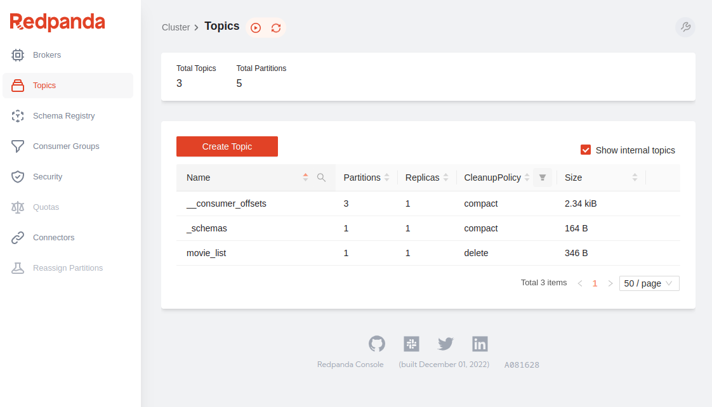
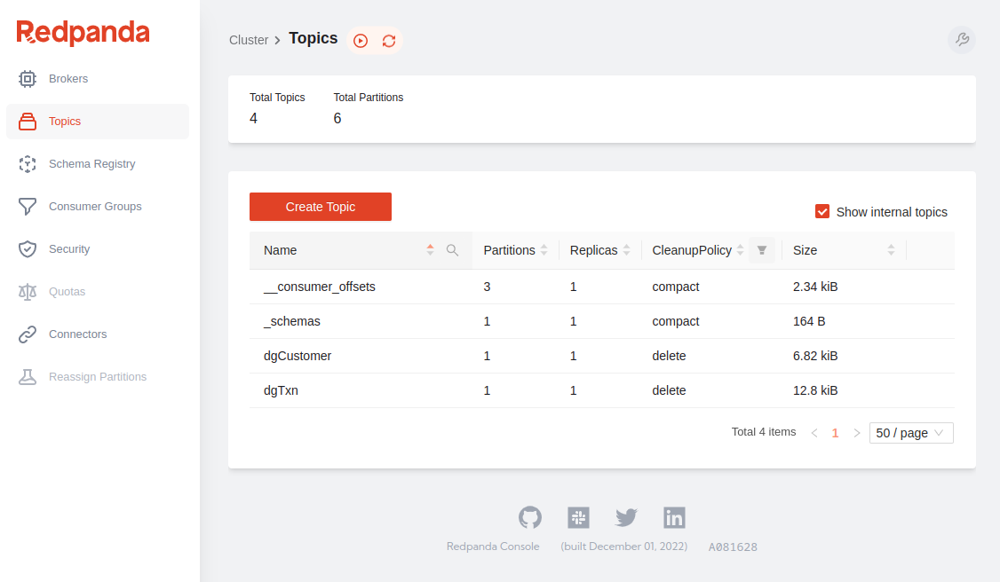
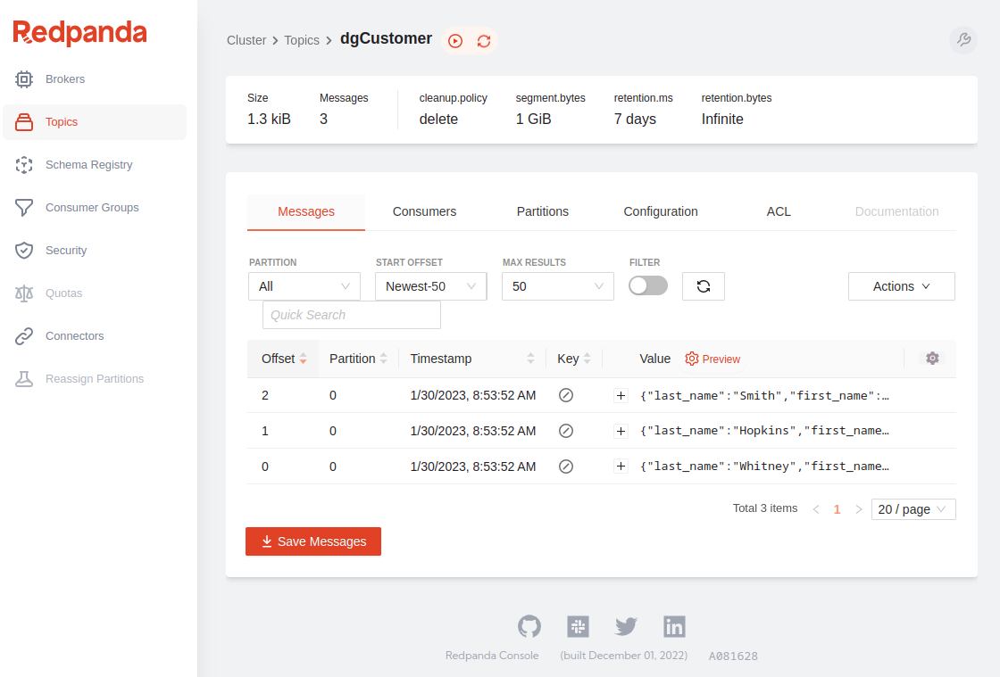
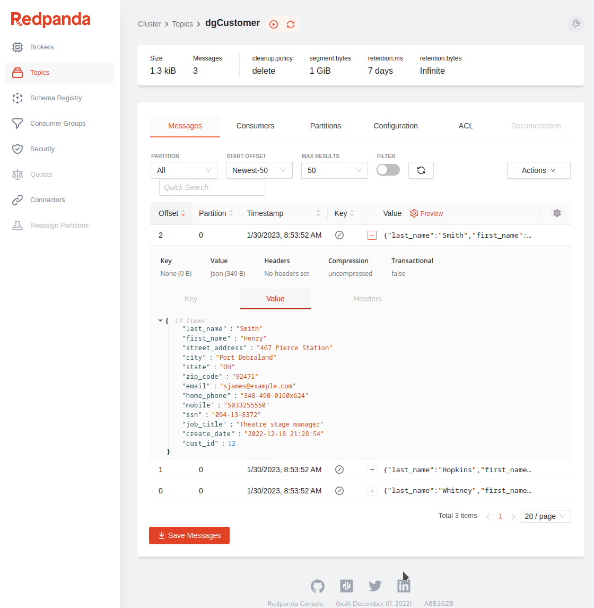

# Data Origination Workshop (WIP)
---

## Objective:

---

###  Install Git tools and pull this repo.
*  ssh into your new Ubuntu 20.04 instance and run the below command:

---

```
sudo apt-get install git-all -y

cd ~
git clone https://github.com/tlepple/data_origination_workshop.git
```

---

### Start the build:

---

```
#  run it:
chmod +x ~/data_origination_workshop/setup_data_origination_apps.sh
. ~/data_origination_workshop/setup_data_origination_apps.sh
```
 * Refill your coffee, this will run for about 5 min.

---
---

###  Explore the Red Panda CLI tool `RPK`  
  *   Add link to RPK descriptions here:

####  From a terminal window run:

```
#  Let's create a topic with RPK
rpk topic create movie_list

```

####  Let's add a few messages to this topic:
  *  this will open a producer session and await your input until you close it with `<ctrl> + d`

```
rpk topic produce movie_list
```

####  Add some movies:

```
#  Entry 1:
Top Gun Maverick

#  Entry 2:
Star Wars - Return of the Jedi
```

  *  exit producer:  `<ctrl> + d`


#### Output:
```
Produced to partition 0 at offset 0 with timestamp 1675085635701.
Star Wars - Return of the Jedi
Produced to partition 0 at offset 1 with timestamp 1675085644895.

```

####  View these messages from CLI with the `Consumer`:

```
rpk topic consume movie_list --num 2
```

---

####  Expected Output:

```
{
  "topic": "movie_list",
  "value": "Top Gun Maverick",
  "timestamp": 1675085635701,
  "partition": 0,
  "offset": 0
}
{
  "topic": "movie_list",
  "value": "Star Wars - Return of the Jedi",
  "timestamp": 1675085644895,
  "partition": 0,
  "offset": 1
}

```
---

####  Delete this topic from the CLI:

```
rpk topic delete movie_list
```

---
---

##  Explore the Red Panda GUI:
  *  Open a browswer and navigate to your host ip address:  `http:\\<your ip address>:8080`  This will open the Red Panda GUI

---
---
  
  
  
---

####  Stream some data to our topics:

---

We will switch to a different OS user `datagen` (password for user: `supersecret1` where some data generation tools were installed during setup.  From a terminal window run:

##### Command:
```
su - datagen
```
---

#####  Let's create some topics for our data generator using the CLI:

```
rpk topic create dgCustomer
rpk topic create dgTxn
```
---
##### Console view of our new `Topics`:
  
---

---
---

### Data Generator:

I have written a data generator CLI application and included it in this workshop to simplify creating some realistic data for us to explore.  We will use this data generator application to stream some data directly to our 2 new topics.

---
---

#####  Data Generator Notes:   

The data generator is written in python and accepts 3 integer parameters:  
  *  An integer value for the `customer key`.
  *  An integer value for the N number of groups to produce in small batches.
  *  An integer value for N number of times to loop until it will exit the script.

#####  Call the Data Generator:

```
cd ~/datagen

#  start the script:
python3 redpanda_dg.py 10 3 2
```

##### Sample Output:

This will load sample json data into our two new topics and write out those records to your terminal that looks something like this:

---

```
{"last_name": "Mcmillan", "first_name": "Linda", "street_address": "7471 Charlotte Fall Suite 835", "city": "Lake Richardborough", "state": "OH", "zip_code": "25649", "email": "tim47@example.org", "home_phone": "001-133-135-5972", "mobile": "001-942-819-7717", "ssn": "321-16-7039", "job_title": "Tourism officer", "create_date": "2022-12-19 20:45:34", "cust_id": 10}
{"last_name": "Hatfield", "first_name": "Denise", "street_address": "5799 Solis Isle", "city": "Josephbury", "state": "LA", "zip_code": "61947", "email": "lhernandez@example.org", "home_phone": "(110)079-8975x48785", "mobile": "976.262.7268", "ssn": "185-93-0904", "job_title": "Engineer, chemical", "create_date": "2022-12-31 00:29:36", "cust_id": 11}
{"last_name": "Adams", "first_name": "Zachary", "street_address": "6065 Dawn Inlet Suite 631", "city": "East Vickiechester", "state": "MS", "zip_code": "52115", "email": "fgrimes@example.com", "home_phone": "001-445-395-1773x238", "mobile": "(071)282-1174", "ssn": "443-22-3631", "job_title": "Maintenance engineer", "create_date": "2022-12-07 20:40:25", "cust_id": 12}
Customer Done.


{"transact_id": "020d5f1c-741d-40b0-8b2a-88ff2cdc0d9a", "category": "teal", "barcode": "5178387219027", "item_desc": "Government training especially.", "amount": 85.19, "transaction_date": "2023-01-07 21:24:17", "cust_id": 10}
{"transact_id": "af9b7e7e-9068-4772-af7e-a8cb63bf555f", "category": "aqua", "barcode": "5092525324087", "item_desc": "Take study after catch.", "amount": 82.28, "transaction_date": "2023-01-18 01:13:13", "cust_id": 10}
{"transact_id": "b11ae666-b85c-4a86-9fbe-8f4fddd364df", "category": "purple", "barcode": "3527261055442", "item_desc": "Likely age store hold.", "amount": 11.8, "transaction_date": "2023-01-26 01:15:46", "cust_id": 10}
{"transact_id": "e968daad-6c14-475f-a183-1afec555dd5f", "category": "olive", "barcode": "7687223414666", "item_desc": "Performance call myself send.", "amount": 67.48, "transaction_date": "2023-01-25 01:51:05", "cust_id": 10}
{"transact_id": "d171c8d7-d099-4a41-bf23-d9534b711371", "category": "teal", "barcode": "9761406515291", "item_desc": "Charge no when.", "amount": 94.57, "transaction_date": "2023-01-05 12:09:58", "cust_id": 11}
{"transact_id": "2297de89-c731-42f1-97a6-98f6b50dd91a", "category": "lime", "barcode": "6484138725655", "item_desc": "Little unit total money raise.", "amount": 47.88, "transaction_date": "2023-01-13 08:16:24", "cust_id": 11}
{"transact_id": "d3e08d65-7806-4d03-a494-6ec844204f64", "category": "black", "barcode": "9827295498272", "item_desc": "Yeah claim city threat approach our.", "amount": 45.83, "transaction_date": "2023-01-07 20:29:59", "cust_id": 11}
{"transact_id": "97cf1092-6f03-400d-af31-d276eff05ecf", "category": "silver", "barcode": "2072026095184", "item_desc": "Heart table see share fish.", "amount": 95.67, "transaction_date": "2023-01-12 19:10:11", "cust_id": 11}
{"transact_id": "11da28af-e463-4f7c-baf2-fc0641004dec", "category": "blue", "barcode": "3056115432639", "item_desc": "Writer exactly single toward same.", "amount": 9.33, "transaction_date": "2023-01-29 02:49:30", "cust_id": 12}
{"transact_id": "c9ebc8a5-3d1a-446e-ac64-8bdd52a1ce36", "category": "fuchsia", "barcode": "6534191981175", "item_desc": "Morning who lay yeah travel use.", "amount": 73.2, "transaction_date": "2023-01-21 02:25:02", "cust_id": 12}
Transaction Done.

```
---

####  Explore Data in the Red Panda Console from a browser
  * `http:\\<your ip address>:8080`  Make sure to click the `Topics` tab in the left side of our Console Application:
---
##### Click on the topic `dgCustomer` from the list.

---

 
 
---

##### Click on the topic '+' icon under the `Value` column to see the record details a message.

---

 
 
---
---
Explore Change Data Capture (CDC) via `Kafka Connect`

Change Data Capture (CDC) is a database technique used to track and record changes made to data in a database. The changes are captured as soon as they occur and stored in a separate log or table, allowing applications to access the most up-to-date information without having to perform a full database query. CDC is often used for real-time data integration and data replication, enabling organizations to maintain a consistent view of their data across multiple systems.

---
---
