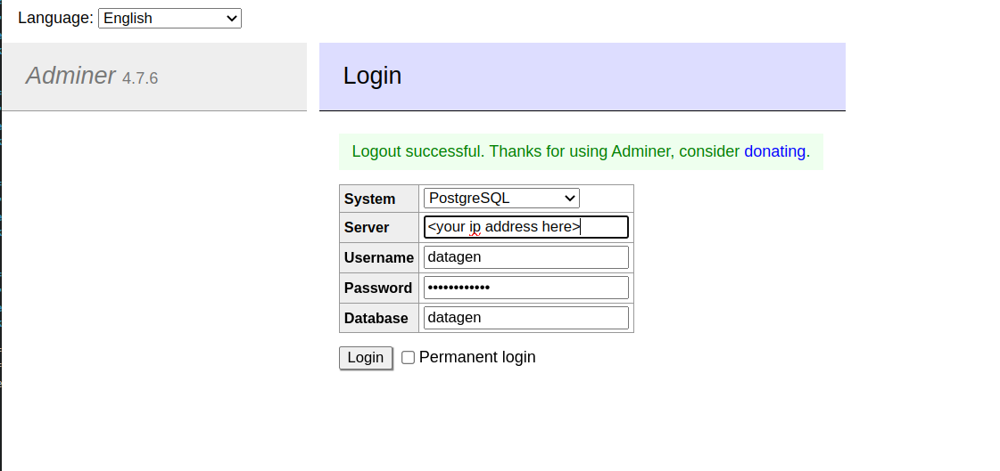
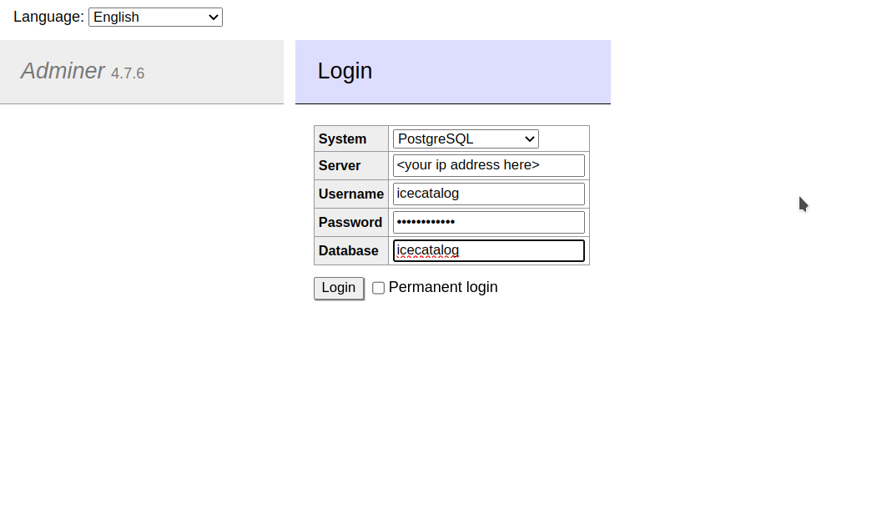

###  (WIP) SQL GUI client access to the PostgreSQL database can be explored using `Adminer` that is installed

---

####  Access the `datagen` database with these credentials:
  *  user     --> `datagen` 
  *  Password --> `supersecret1`
  *  
*  From a browser navigate to: `http://<your ip address>/adminer` 

##### `Datagen` database:

####  Access the `icecatalog` database with these credentials:
  *  user     --> `icecatalog` 
  *  Password --> `supersecret1`
  *  
*  From a browser navigate to: `http://<your ip address>/adminer` 

##### `Datagen` database:

---
---
Click here to return to main page:  [`Workshop 2 Exercises`](./README.md/#extra-credit).
